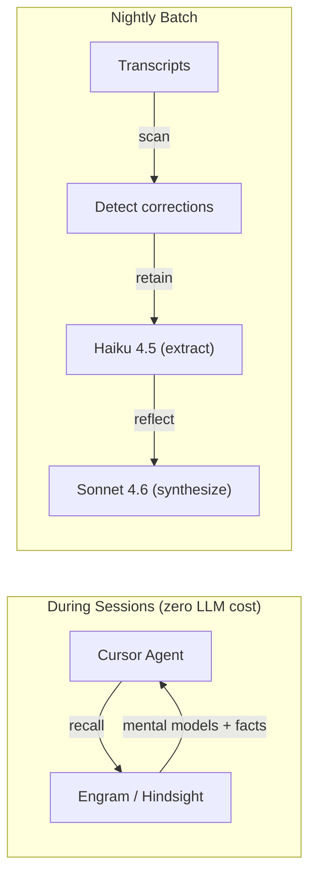
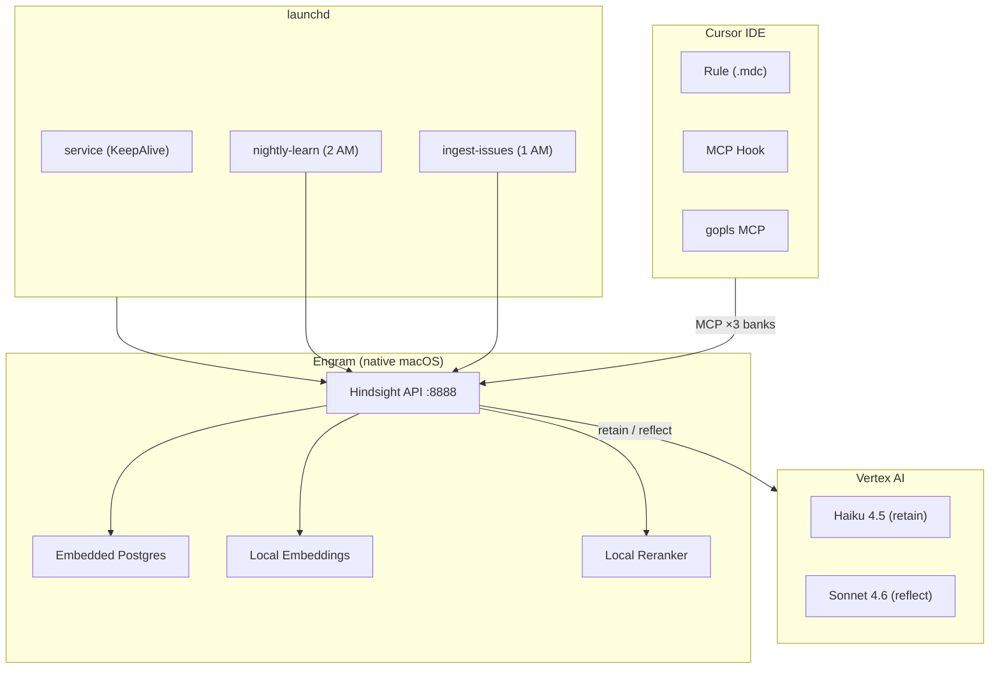

# Engram

**Persistent memory traces for AI coding assistants.**

Engram gives your Cursor IDE agent memory that survives across sessions. Every
correction you make is encoded as a persistent trace — stored in a knowledge
graph, synthesized into mental models, and automatically surfaced in future
sessions so the same mistake never happens twice.

## How it works



**Recall is local and free** — embeddings and reranking run on-device (~600ms).
LLM calls only happen overnight for pattern extraction.

## What it solves

| Problem | How Engram fixes it |
|---------|-------------------|
| Every session starts with amnesia | Recall surfaces past corrections automatically |
| Repeating the same mistakes | Corrections are stored as persistent patterns |
| Scattered knowledge across docs/issues | Mental models synthesize coherent context |
| No way to know if memory helps | Nightly metrics track correction reduction rate |

## Key features

- **Zero-cost recall** — local vector search, no tokens consumed during work
- **Learns from corrections** — detects when you correct the agent, extracts the lesson
- **Knowledge graph** — entities link across sessions for richer retrieval
- **Mental models** — pre-synthesized documents (not scattered facts)
- **Multi-bank architecture** — behavioral memory + project docs + GitHub issues
- **Self-evaluating** — proactive recall rate, correction reduction %, hit rates
- **Runs as macOS service** — launchd-managed, survives reboots, auto-restarts

## Quick start

```bash
git clone https://github.com/jordigilh/engram.git
cd engram
```

Then follow the [Installation Guide](docs/INSTALL.md) (takes ~15 minutes).

## Architecture



## Cost

| Operation | Model | Frequency | Cost |
|-----------|-------|-----------|------|
| Recall | Local (no LLM) | Every response | $0 |
| Retain | Haiku 4.5 | ~23 windows/night | ~$0.02 |
| Reflect | Sonnet 4.6 | Once/night | ~$0.10 |

**≈ $0.12/night** for a full learning cycle.

## Documentation

| Doc | Content |
|-----|---------|
| [Installation Guide](docs/INSTALL.md) | Full setup, prerequisites, verification |
| [Customizing the Rule](docs/INSTALL.md#customizing-the-rule) | Adapt for your project (Python, Rust, etc.) |
| [Architecture & Internals](docs/README.md) | Design decisions, knowledge graph, correction detection |
| [Metrics & Monitoring](docs/METRICS.md) | Effectiveness tracking, proactive recall, report interpretation |

## License

MIT
