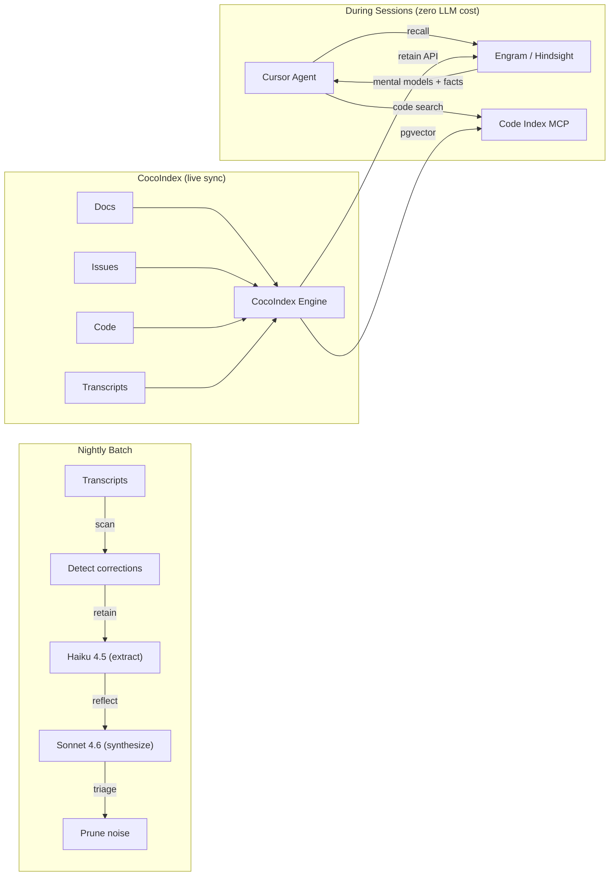
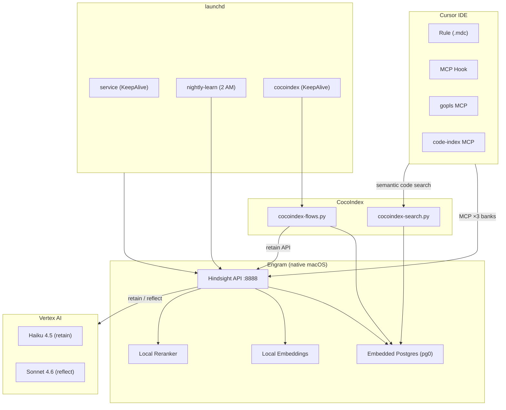
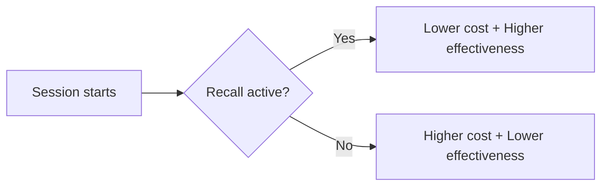

# Engram

**Persistent memory traces for AI coding assistants.**

Engram gives your Cursor IDE agent memory that survives across sessions. Every
correction you make is encoded as a persistent trace — stored in a knowledge
graph, synthesized into mental models, and automatically surfaced in future
sessions so the same mistake never happens twice.

## How it works



**Recall is local and free** — embeddings and reranking run on-device (~600ms).
LLM calls only happen overnight for pattern extraction.

## What it solves

| Problem | How Engram fixes it |
|---------|-------------------|
| Every session starts with amnesia | Recall surfaces past corrections automatically |
| Repeating the same mistakes | Corrections are stored as persistent patterns |
| Scattered knowledge across docs/issues/PRs | Mental models synthesize coherent context |
| Agent wastes tokens exploring the codebase | CocoIndex front-loads semantic code context via recall |
| No way to know if memory helps | Metrics track correction reduction, exploration efficiency, per-bank K-score |

## Key features

- **Zero-cost recall** — local vector search, no tokens consumed during work
- **Learns from corrections** — detects when you correct the agent, extracts the lesson
- **Knowledge graph** — entities link across sessions for richer retrieval
- **Mental models** — pre-synthesized documents (not scattered facts)
- **Multi-bank architecture** — behavioral memory + project docs + GitHub issues/PRs + code index
- **CocoIndex live sync** — docs, code, and transcripts watch for filesystem changes in real time; issues and PRs poll GitHub every 5 minutes. All four flows run concurrently as threads in a single launchd service
- **Semantic code search** — tree-sitter AST parsing extracts functions, types, and methods into pgvector embeddings, searchable via MCP
- **Self-cleaning** — nightly triage removes ephemeral, stale, and duplicate memories
- **Self-evaluating** — exploration efficiency, per-bank K-score, correction reduction %, ingestion coverage, data freshness, baseline comparison
- **Recoverable** — transcripts are source of truth; `recover-memories.py` rebuilds the bank
- **Runs as macOS service** — launchd-managed, survives reboots, auto-restarts

## Quick start

```bash
git clone https://github.com/jordigilh/engram.git
cd engram
```

Then follow the [Installation Guide](docs/INSTALL.md) (takes ~15 minutes).

## Architecture



## Cost

| Operation | Model | Frequency | Cost |
|-----------|-------|-----------|------|
| Recall | Local (no LLM) | Every response | $0 |
| Retain | Haiku 4.5 | ~23 windows/night | ~$0.02 |
| Reflect | Sonnet 4.6 | Once/night | ~$0.10 |
| CocoIndex sync | Local (no LLM) | Continuous | $0 |

**≈ $0.12/night** for a full learning cycle.

## Value: the K-curve

Engram's impact is a **K-shaped divergence** — sessions with recall simultaneously
consume fewer tokens AND produce better outcomes:



**Where the tokens go:**

| Phase | Without Engram | With Engram |
|-------|---------------|-------------|
| Context loading (education) | ~8,400 tokens | ~200 tokens |
| Corrections (rework) | ~3.2/session × ~5K each | ~0.8/session × ~5K each |
| Productive work | Same | Same |
| **Total session cost** | **~62K tokens** | **~45K tokens** |

**The K-score** measures token efficiency: productive actions per 1,000 tokens spent.
Sessions with recall produce more output per token while wasting less on orientation
and rework.

| Metric | Without Engram | With Engram | Delta |
|--------|---------------|-------------|-------|
| Context loading | ~8,400 tok | ~200 tok | **-97%** |
| Corrections/session | 3.2 | 0.8 | -75% |
| Effectiveness ratio | 0.18 | 0.31 | **+72%** |
| **K-score** | | | **1.72x** |

A K-score of 1.72 means every token works 1.72x harder when Engram is active.
At 5 sessions/day over a month, this translates to:

- **~17K fewer tokens/session** in wasted context loading and corrections
- **~1.7M tokens/month saved** (20 working days × 5 sessions)
- At Sonnet pricing (~$15/M tokens): **~$25/month saved** for **$3.60/month** cost

> Run `python3 report.py` to see your measured K-score. The metric requires
> sessions both with and without recall for comparison — initial data may show
> K < 1.0 until recall adoption stabilizes above 30%.

## Expected benefits from CocoIndex integration

CocoIndex replaces batch scripts with continuous, incremental ingestion across
four source types. The expected improvements:

| Dimension | Before (batch scripts) | After (CocoIndex live sync) |
|-----------|----------------------|----------------------------|
| **Issues coverage** | 500 items (hardcoded cap) | All issues + PRs (~1,471 items) |
| **Issues freshness** | ~24 hours (nightly batch) | < 5 minutes (polling every 300s) |
| **Docs freshness** | Manual re-run | Instant (filesystem watching) |
| **Code search** | Not available | Semantic search via pgvector + tree-sitter |
| **Transcript learning** | Nightly only | Continuous detection + nightly extraction |
| **Exploration overhead** | Agent greps/globs for context | Recall front-loads synthesized knowledge |

**How to measure whether it's working:**

```bash
# Full effectiveness report with all metrics
python3 report.py

# Take a baseline snapshot before changes
python3 report.py --snapshot

# Compare against a previous baseline
python3 report.py --compare ~/.hindsight/logs/baseline-2026-06-22.json
```

Key metrics to watch:
- **Exploration efficiency** — are recall sessions needing fewer grep/glob calls?
- **Correction reduction %** — are corrections declining with recall active?
- **Per-bank K-score** — which knowledge sources contribute most?
- **Ingestion coverage** — is everything indexed?
- **Data freshness** — is the data current?

## Documentation

| Doc | Content |
|-----|---------|
| [Installation Guide](docs/INSTALL.md) | Full setup, prerequisites, verification |
| [Customizing the Rule](docs/INSTALL.md#customizing-the-rule) | Adapt for your project (Python, Rust, etc.) |
| [Architecture & Internals](docs/README.md) | Design decisions, knowledge graph, correction detection |
| [CocoIndex Operations](docs/COCOINDEX.md) | Flow catalog, running modes, monitoring, troubleshooting |
| [Metrics & Monitoring](docs/METRICS.md) | Effectiveness tracking, proactive recall, triage, report interpretation |
| [Research Findings](docs/FINDINGS.md) | Empirical results, incidents, and lessons learned |

## License

MIT
