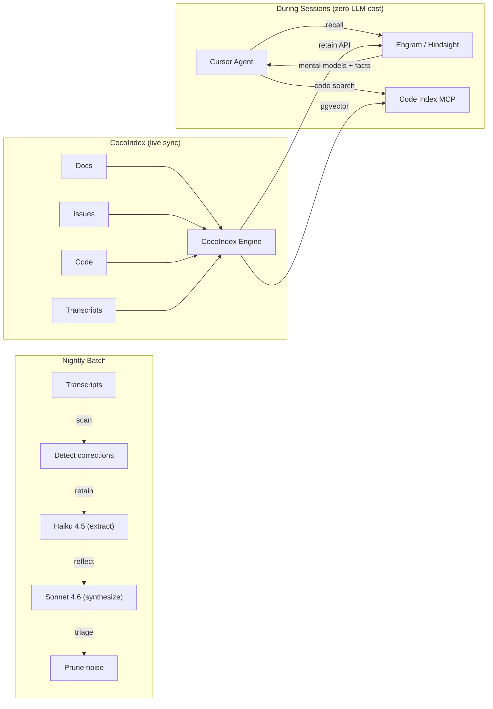
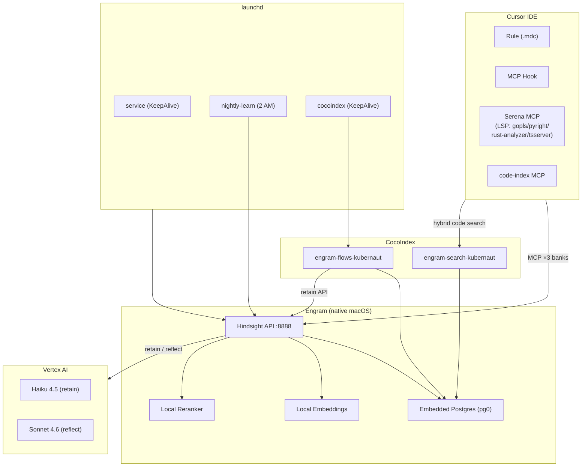

# Engram

**Persistent memory traces for AI coding assistants.**

Engram gives your Cursor IDE agent memory that survives across sessions. Every
correction you make is encoded as a persistent trace — stored in a knowledge
graph, synthesized into mental models, and automatically surfaced in future
sessions so the same mistake never happens twice.

## How it works


```mermaid
flowchart LR
    subgraph session["During Sessions (zero LLM cost)"]
        A[Cursor Agent] -->|recall| B[Engram / Hindsight]
        B -->|"mental models + facts"| A
        A -->|code search| CI_MCP[Code Index MCP]
    end

    subgraph nightly["Nightly Batch"]
        C[Transcripts] -->|scan| D[Detect corrections]
        D -->|retain| E["Haiku 4.5 (extract)"]
        E -->|reflect| F["Sonnet 4.6 (synthesize)"]
        F -->|triage| G["Prune noise"]
    end

    subgraph cocoindex["CocoIndex (live sync)"]
        docs_src[Docs] --> CI[CocoIndex Engine]
        issues_src[Issues] --> CI
        code_src[Code] --> CI
        transcripts_src[Transcripts] --> CI
        CI -->|"retain API"| B
        CI -->|"pgvector"| CI_MCP
    end
```

**Recall is local and free** — embeddings and reranking run on-device (~600ms).
LLM calls only happen overnight for pattern extraction.

## What it solves

| Problem | How Engram fixes it |
|---------|-------------------|
| Every session starts with amnesia | Recall surfaces past corrections automatically |
| Repeating the same mistakes | Corrections are stored as persistent patterns |
| Scattered knowledge across docs/issues/PRs | Mental models synthesize coherent context |
| Agent wastes tokens exploring the codebase | CocoIndex front-loads semantic code context via recall |
| "What breaks if I change this?" requires manual tracing | Call-graph tools answer blast radius, shortest path, and clustering directly |
| No way to know if memory helps | Weekly trend metrics track corrections, rework, and productivity over time |

## Key features

- **Zero-cost recall** — local vector search, no tokens consumed during work
- **Learns from corrections** — detects when you correct the agent, extracts the lesson
- **Knowledge graph** — entities link across sessions for richer retrieval
- **Mental models** — pre-synthesized documents (not scattered facts)
- **Multi-bank architecture** — behavioral memory + project docs + GitHub issues/PRs + code index
- **CocoIndex live sync** — docs, code, and transcripts watch for filesystem changes in real time; issues and PRs poll GitHub every 5 minutes. All four flows run concurrently as threads in a single launchd service
- **Hybrid code search** — tree-sitter AST-aware chunking (via cocoindex's `RecursiveSplitter`) keeps chunk boundaries on function/type/block nodes instead of arbitrary character offsets; dense embeddings (pgvector) handle semantic queries while BM25 (tsvector + GIN) handles exact identifiers — results fused via Reciprocal Rank Fusion
- **Structural pattern search** — tree-sitter by-example matching (cocoindex's `CodePattern`) answers "find code shaped like X" (e.g. every function matching a signature) as a distinct MCP tool per project, complementing (not replacing) hybrid search's "find code about X" and Serena's type-aware navigation (find_symbol/find_referencing_symbols/diagnostics) — see docs/COCOINDEX.md
- **Call-graph extraction + clustering** — cross-file call graphs built from the same `CodePattern` infrastructure (no new tree-sitter dependency) answer relational questions `CodePattern` alone can't: blast radius ("what breaks if I change this"), shortest path between two functions, and Leiden-based clustering of related functions. Rolled out across every onboarded project (Python/TypeScript/Rust/Go), with a Postgres-backed cache for the one repo large enough to need it — see [docs/CALL_GRAPH_DESIGN.md](docs/CALL_GRAPH_DESIGN.md) for how it works and [docs/CALL_GRAPH_CLUSTERING.md](docs/CALL_GRAPH_CLUSTERING.md) for the findings behind it
- **LSP-backed code intelligence** — [Serena](https://github.com/oraios/serena) is the default code-intelligence MCP backend across every onboarded project, wrapping each language's real LSP (`gopls`, `pyright`, `rust-analyzer`, `typescript-language-server`) behind one consistent tool surface, so agents get real symbol lookup/find-references/diagnostics instead of grepping for identifiers — see [docs/NEW_PROJECT_SETUP.md §7](docs/NEW_PROJECT_SETUP.md#7-choose-your-code-intelligence-backend) for setup and [docs/README.md's Division of Labor](docs/README.md#hindsight-vs-cocoindex-vs-serena-division-of-labor) for how it differs from Hindsight/CocoIndex
- **Self-cleaning** — nightly triage removes ephemeral, stale, and duplicate memories
- **Self-evaluating** — weekly trend metrics (corrections/session, rework %, productivity density), exploration efficiency, ingestion coverage, data freshness
- **Recoverable** — transcripts are source of truth; `python3 -m engram.maintenance.recover_memories` rebuilds the bank
- **Runs as macOS service** — launchd-managed, survives reboots, auto-restarts

## Quick start

```bash
git clone https://github.com/jordigilh/engram.git
cd engram
```

Then follow the [Installation Guide](docs/INSTALL.md) (takes ~15 minutes).
On Linux/Fedora/RHEL, use [`docs/INSTALL-linux.md`](docs/INSTALL-linux.md) instead
for the platform-specific steps (containerized Hindsight via Podman Quadlets,
native batch scripts via systemd timers) — the rest of the guide applies
unchanged on either platform.

## Architecture


```mermaid
graph TB
    subgraph cursor["Cursor IDE"]
        rule["Rule (.mdc)"]
        hook["MCP Hook"]
        serena["Serena MCP<br/>(LSP: gopls/pyright/<br/>rust-analyzer/tsserver)"]
        code_mcp["code-index MCP"]
    end

    subgraph engram["Engram (native macOS)"]
        api["Hindsight API :8888"]
        pg["Embedded Postgres (pg0)"]
        emb["Local Embeddings"]
        rerank["Local Reranker"]
    end

    subgraph cocoindex_engine["CocoIndex"]
        coco["engram-flows-kubernaut"]
        coco_search["engram-search-kubernaut"]
        coco --> pg
        coco_search --> pg
    end

    subgraph vertex["Vertex AI"]
        haiku["Haiku 4.5 (retain)"]
        sonnet["Sonnet 4.6 (reflect)"]
    end

    subgraph launchd["launchd"]
        svc["service (KeepAlive)"]
        nightly["nightly-learn (2 AM)"]
        coco_svc["cocoindex (KeepAlive)"]
    end

    cursor -->|"MCP ×3 banks"| api
    cursor -->|"hybrid code search"| coco_search
    api --> pg
    api --> emb
    api --> rerank
    api -->|"retain / reflect"| vertex
    launchd --> api
    nightly --> api
    coco_svc --> coco
    coco -->|"retain API"| api
```

## Cost

| Operation | Model | Frequency | Cost |
|-----------|-------|-----------|------|
| Recall | Local (no LLM) | Every response | $0 |
| Retain | Haiku 4.5 | ~23 windows/night | ~$0.02 |
| Reflect | Sonnet 4.6 | Once/night | ~$0.10 |
| CocoIndex sync | Local (no LLM) | Continuous | $0 |

**≈ $0.12/night** for a full learning cycle.

## Value: measuring effectiveness

Engram tracks its own impact through **weekly trend metrics** that measure
recall sessions over time. By tracking within the same cohort (sessions that
use recall), week over week, we avoid selection bias and get a clear signal.

**Key metrics tracked weekly:**

| Metric | What it measures | Goal |
|--------|-----------------|------|
| **Corrections/session** | User corrections per session | Lower = fewer mistakes |
| **Rework %** | Tokens spent on correction loops | Lower = less waste |
| **Productivity density** | Productive actions per 1K tokens | Higher = more efficient |
| **First productive turn** | Turn where real work starts | Lower = faster ramp-up |

**Where Engram saves tokens:**

| Phase | Without Engram | With Engram |
|-------|---------------|-------------|
| Context loading (education) | ~8,400 tokens | ~200 tokens |
| Corrections (rework) | ~3.2/session × ~5K each | ~0.8/session × ~5K each |
| Productive work | Same | Same |
| **Total session cost** | **~62K tokens** | **~45K tokens** |

At 5 sessions/day over a month, this translates to:

- **~17K fewer tokens/session** in wasted context loading and corrections
- **~1.7M tokens/month saved** (20 working days × 5 sessions)
- At Sonnet pricing (~$15/M tokens): **~$25/month saved** for **$3.60/month** cost

> Run `python3 -m engram.maintenance.report` to see your weekly trends and session stats.
> The [Effectiveness Dashboard](docs/DASHBOARD.md) auto-updates nightly.

## Expected benefits from CocoIndex integration

CocoIndex replaces batch scripts with continuous, incremental ingestion across
four source types. The expected improvements:

| Dimension | Before (batch scripts) | After (CocoIndex live sync) |
|-----------|----------------------|----------------------------|
| **Issues coverage** | 500 items (hardcoded cap) | All issues + PRs (~1,471 items) |
| **Issues freshness** | ~24 hours (nightly batch) | < 5 minutes (polling every 300s) |
| **Docs freshness** | Manual re-run | Instant (filesystem watching) |
| **Code search** | Not available | Hybrid search (dense + BM25 via RRF) over pgvector + tree-sitter |
| **Transcript learning** | Nightly only | Continuous detection + nightly extraction |
| **Exploration overhead** | Agent greps/globs for context | Recall front-loads synthesized knowledge |

**How to measure whether it's working:**

```bash
# Full effectiveness report with all metrics
python3 -m engram.maintenance.report

# Take a baseline snapshot before changes
python3 -m engram.maintenance.report --snapshot

# Compare against a previous baseline
python3 -m engram.maintenance.report --compare ~/.hindsight/logs/baseline-2026-06-22.json
```

Key metrics to watch:
- **Corrections/session** — are corrections declining week over week?
- **Rework %** — is the agent spending less time on correction loops?
- **Productivity density** — are more productive actions produced per token?
- **Exploration efficiency** — are recall sessions needing fewer grep/glob calls?
- **Ingestion coverage** — is everything indexed?
- **Data freshness** — is the data current?

## Documentation

| Doc | Content |
|-----|---------|
| [Installation Guide](docs/INSTALL.md) | Full setup, prerequisites, verification (macOS-native Hindsight) |
| [Linux/Fedora/RHEL Installation](docs/INSTALL-linux.md) | Platform-specific steps: containerized Hindsight (Podman Quadlet), systemd timers |
| [Customizing the Rule](docs/INSTALL.md#customizing-the-rule) | Ready-made rules for Go, Python, Rust, TypeScript, or any stack |
| [Architecture & Internals](docs/README.md) | Design decisions, knowledge graph, correction detection |
| [CocoIndex Operations](docs/COCOINDEX.md) | Flow catalog, running modes, monitoring, troubleshooting |
| [Call-Graph Design](docs/CALL_GRAPH_DESIGN.md) | How call-graph extraction, resolution, clustering, and caching actually work |
| [Call-Graph Findings](docs/CALL_GRAPH_CLUSTERING.md) | Chronological spike + multi-org rollout findings, bugs found, precision measurements |
| [Metrics & Monitoring](docs/METRICS.md) | Effectiveness tracking, proactive recall, triage, report interpretation |
| [Effectiveness Dashboard](docs/DASHBOARD.md) | Daily metrics trend, auto-updated by nightly pipeline |
| [Research Findings](docs/FINDINGS.md) | Empirical results, incidents, and lessons learned |

## License

MIT
