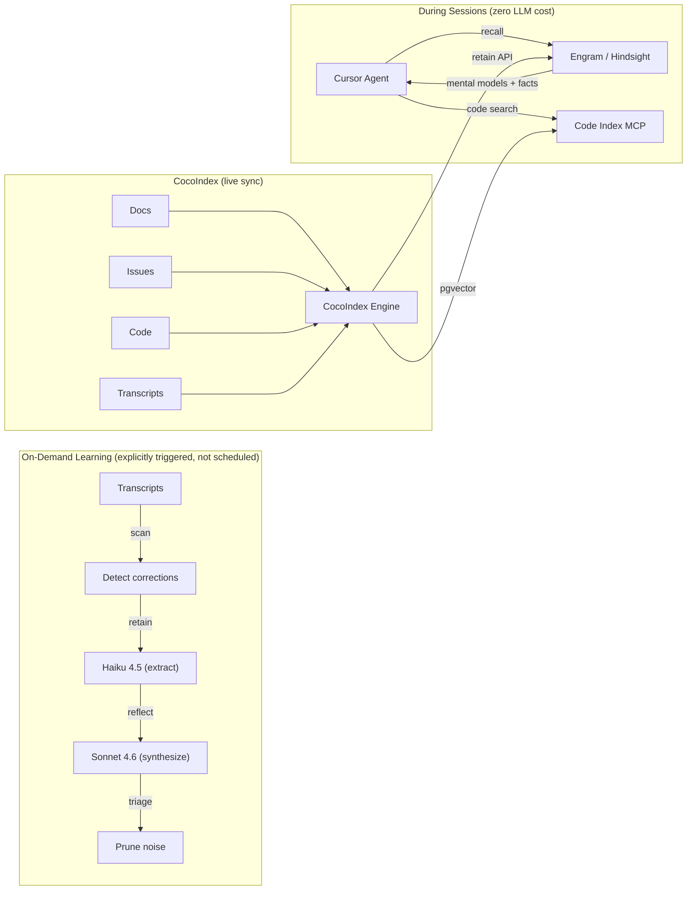
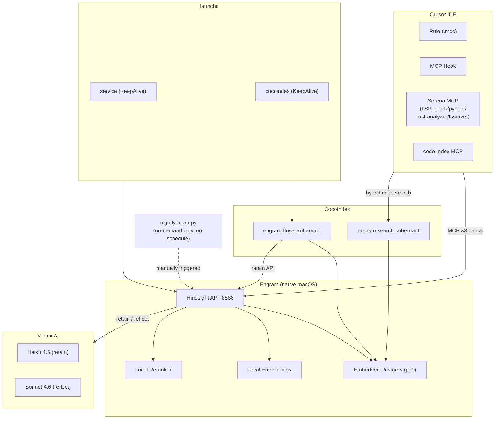

# Engram

**Makes your Cursor agent more effective by grounding it in an accurate,
current understanding of your codebase and its history.**

An agent's biggest bottleneck isn't typing speed — it's rebuilding context.
Left alone, it re-derives "what calls this," "why was it built this way,"
and "is this still true" from scratch every session, via long chains of
grep/glob/read sweeps, or worse, from stale training data that doesn't
reflect what's actually in the repo today. Engram closes that gap: a
call graph and knowledge graph built directly from your live corpus (code,
docs, issues, and past corrections), synthesized into mental models and
surfaced automatically — so reviews and new features are grounded in what's
*actually* true right now, not an approximation.

Needing fewer exploratory sweeps to reach that accuracy is also, naturally,
cheaper — reduced token consumption is a measured side effect of this, not
the goal (see [Value](#value-measuring-effectiveness) below).

## How it works


```mermaid
flowchart LR
    subgraph session["During Sessions (zero LLM cost)"]
        A[Cursor Agent] -->|recall| B[Engram / Hindsight]
        B -->|"mental models + facts"| A
        A -->|code search| CI_MCP[Code Index MCP]
    end

    subgraph ondemand["On-Demand Learning (explicitly triggered, not scheduled)"]
        C[Transcripts] -->|scan| D[Detect corrections]
        D -->|retain| E["Haiku 4.5 (extract)"]
        E -->|reflect| F["Sonnet 4.6 (synthesize)"]
        F -->|triage| G["Prune noise"]
    end

    subgraph cocoindex["CocoIndex (live sync)"]
        docs_src[Docs] --> CI[CocoIndex Engine]
        issues_src[Issues] --> CI
        code_src[Code] --> CI
        transcripts_src[Transcripts] --> CI
        CI -->|"retain API"| B
        CI -->|"pgvector"| CI_MCP
    end
```

**Recall is local and free** — embeddings and reranking run on-device (~600ms).
Retain/reflect/triage's LLM calls are on-demand only, triggered explicitly
in-chat or by hand — there is no scheduled background job spending tokens
automatically. This was a deliberate reversal (2026-08-13): the original
design ran these hourly/nightly, but that schedule kept paying for
extraction and synthesis passes regardless of whether the day's transcripts
actually contained anything worth learning, with no visibility into that
cost until the bill showed up. On-demand keeps LLM cost visible and bounded
until there's a well-understood, worthwhile cost/value ratio for bringing
scheduled automation back — see [docs/findings/2026-08.md](docs/findings/2026-08.md)'s
2026-08-13 entries for the full incident and decision record.

## What it solves

Three components, each closing a different gap, working together:

| Problem | How Engram fixes it |
|---------|-------------------|
| Agent burns many grep/glob/read sweeps just to answer "what calls this" or "how does X work" | **CocoIndex**'s call-graph tools (blast radius, shortest path, clustering) + hybrid/structural code search answer relational and semantic questions directly, in one call |
| Training data and mental context go stale the moment code changes, risking wrong or outdated reviews/features | **CocoIndex** live-syncs docs/code/issues continuously, so results always reflect the current corpus, not a snapshot |
| Reviews and new features can contradict past decisions or repeat already-solved mistakes | **Hindsight**'s knowledge graph + mental models surface prior corrections, conventions, and architecture decisions automatically |
| Every session starts with amnesia, repeating the same mistakes | **Hindsight**'s recall surfaces past corrections automatically; they become persistent patterns |
| Text-based rename/refactor risks missed references or false-positive matches across languages | **Serena**'s LSP-backed `rename_symbol`/`replace_symbol_body` apply refactors via real compiler semantics, language-agnostically |
| No way to know if any of this is actually helping | Weekly trend metrics track corrections, rework, exploration efficiency, and productivity over time |
| *(side effect)* Exploration and rework waste tokens | Fewer sweeps + fewer repeated mistakes → lower token cost — tracked as a metric, not the primary goal |

Each component covers genuinely distinct ground and none can substitute for
the other two — see [docs/README.md's Division of Labor](docs/README.md#hindsight-vs-cocoindex-vs-serena-division-of-labor)
for the full breakdown of how CocoIndex, Hindsight, and Serena divide
responsibility.

## Key features

- **Call-graph extraction + clustering** — cross-file call graphs answer relational questions grep/glob can't: blast radius ("what breaks if I change this"), shortest path between two functions, and Leiden-based clustering of related functions. Rolled out across every onboarded project (Python/TypeScript/Rust/Go), with a Postgres-backed cache for the one repo large enough to need it — see [docs/CALL_GRAPH_DESIGN.md](docs/CALL_GRAPH_DESIGN.md) for how it works and [docs/CALL_GRAPH_CLUSTERING.md](docs/CALL_GRAPH_CLUSTERING.md) for the findings behind it
- **LSP-backed code intelligence, language-agnostic by construction** — the same tool surface (`find_symbol`/`find_referencing_symbols`/diagnostics) works identically whether the repo is Go, Python, Rust, or TypeScript, wrapping each language's real LSP (`gopls`, `pyright`, `rust-analyzer`, `typescript-language-server`). Includes **semantic refactoring** (`rename_symbol`, `replace_symbol_body`): a rename or body replacement is resolved and applied via the compiler's own understanding of the code, not text search-replace, so every real reference updates correctly and an unrelated same-named match elsewhere is never touched — see [docs/NEW_PROJECT_SETUP.md §7](docs/NEW_PROJECT_SETUP.md#7-choose-your-code-intelligence-backend) for setup
- **Hybrid code search** — tree-sitter AST-aware chunking keeps chunk boundaries on function/type/block nodes instead of arbitrary character offsets; dense embeddings (pgvector) handle semantic queries while BM25 (tsvector + GIN) handles exact identifiers — results fused via Reciprocal Rank Fusion
- **Structural pattern search** — tree-sitter by-example matching answers "find code shaped like X" (e.g. every function matching a signature) as a distinct MCP tool per project — see docs/COCOINDEX.md
- **Live sync** — docs, code, and transcripts watch for filesystem changes in real time; issues and PRs poll GitHub every 5 minutes, so nothing reflects a stale snapshot
- **Knowledge graph** — entities link across sessions for richer retrieval
- **Mental models** — pre-synthesized documents (not scattered facts)
- **Learns from corrections** — detects when you correct the agent, extracts the lesson
- **Zero-cost recall** — local vector search, no tokens consumed during work
- **Multi-bank architecture** — behavioral memory + project docs + GitHub issues/PRs + code index
- **Self-cleaning** — on-demand triage removes ephemeral, stale, and duplicate memories
- **Self-evaluating** — weekly trend metrics (corrections/session, rework %, exploration efficiency, productivity density), ingestion coverage, data freshness
- **Recoverable** — transcripts are source of truth; `python3 -m engram.maintenance.recover_memories` rebuilds the bank

See [docs/README.md's Division of Labor](docs/README.md#hindsight-vs-cocoindex-vs-serena-division-of-labor) for which of Hindsight, CocoIndex, or Serena is responsible for each of these.

## Quick start

```bash
git clone https://github.com/jordigilh/engram.git
cd engram
```

Then follow the [Installation Guide](docs/INSTALL.md) (takes ~15 minutes).
On Linux/Fedora/RHEL, use [`docs/INSTALL-linux.md`](docs/INSTALL-linux.md) instead
for the platform-specific steps (containerized Hindsight via Podman Quadlets,
native batch scripts via systemd timers) — the rest of the guide applies
unchanged on either platform.

## Architecture


```mermaid
graph TB
    subgraph cursor["Cursor IDE"]
        rule["Rule (.mdc)"]
        hook["MCP Hook"]
        serena["Serena MCP<br/>(LSP: gopls/pyright/<br/>rust-analyzer/tsserver)"]
        code_mcp["code-index MCP"]
    end

    subgraph engram["Engram (native macOS)"]
        api["Hindsight API :8888"]
        pg["Embedded Postgres (pg0)"]
        emb["Local Embeddings"]
        rerank["Local Reranker"]
    end

    subgraph cocoindex_engine["CocoIndex"]
        coco["engram-flows-kubernaut"]
        coco_search["engram-search-kubernaut"]
        coco --> pg
        coco_search --> pg
    end

    subgraph vertex["Vertex AI"]
        haiku["Haiku 4.5 (retain)"]
        sonnet["Sonnet 4.6 (reflect)"]
    end

    subgraph launchd["launchd"]
        svc["service (KeepAlive)"]
        coco_svc["cocoindex (KeepAlive)"]
    end

    nightly["nightly-learn.py<br/>(on-demand only, no schedule)"]

    cursor -->|"MCP ×3 banks"| api
    cursor -->|"hybrid code search"| coco_search
    api --> pg
    api --> emb
    api --> rerank
    api -->|"retain / reflect"| vertex
    launchd --> api
    nightly -.->|"manually triggered"| api
    coco_svc --> coco
    coco -->|"retain API"| api
```

## Value: measuring effectiveness

The goal is more effective, more accurate reviews and feature work — fewer
wrong assumptions, fewer contradicted decisions, fewer sweeps to find the
right context. Engram tracks its own impact through **weekly trend metrics**
that measure recall sessions over time. By tracking within the same cohort
(sessions that use recall), week over week, we avoid selection bias and get a
clear signal.

**Key metrics tracked weekly:**

| Metric | What it measures | Goal |
|--------|-----------------|------|
| **Corrections/session** | User corrections per session | Lower = fewer mistakes |
| **Exploration efficiency** | grep/glob/search calls needed to reach relevant context | Lower = fewer sweeps, more direct answers |
| **Rework %** | Tokens spent on correction loops (a downstream side effect of the above, not the primary goal) | Lower = less waste |
| **Productivity density** | Productive actions per 1K tokens | Higher = more efficient |
| **First productive turn** | Turn where real work starts | Lower = faster ramp-up |

Token/cost savings follow directly from fewer exploration sweeps and fewer
correction loops — see [docs/METRICS.md](docs/METRICS.md#token-and-cost-side-effects)
for the measured numbers; this README leads with the accuracy/effectiveness
story since that's the actual goal.

> Run `python3 -m engram.maintenance.report` to see your weekly trends and session stats.
> The [Effectiveness Dashboard](docs/DASHBOARD.md) updates whenever `engram-nightly-learn`
> is run (on-demand — see [How it works](#how-it-works) above).

## Expected benefits from CocoIndex integration

CocoIndex replaces batch scripts with continuous, incremental ingestion across
four source types. The expected improvements:

| Dimension | Before (batch scripts) | After (CocoIndex live sync) |
|-----------|----------------------|----------------------------|
| **Issues coverage** | 500 items (hardcoded cap) | All issues + PRs (~1,471 items) |
| **Issues freshness** | ~24 hours (nightly batch) | < 5 minutes (polling every 300s) |
| **Docs freshness** | Manual re-run | Instant (filesystem watching) |
| **Code search** | Not available | Hybrid search (dense + BM25 via RRF) over pgvector + tree-sitter |
| **Transcript learning** | Nightly batch only | Continuous detection (regex, zero LLM cost) + on-demand extraction |
| **Exploration overhead** | Agent greps/globs for context | Recall front-loads synthesized knowledge |

**How to measure whether it's working:**

```bash
# Full effectiveness report with all metrics
python3 -m engram.maintenance.report

# Take a baseline snapshot before changes
python3 -m engram.maintenance.report --snapshot

# Compare against a previous baseline
python3 -m engram.maintenance.report --compare ~/.hindsight/logs/baseline-2026-06-22.json
```

Key metrics to watch (see [Value](#value-measuring-effectiveness) above for
the full list and what each one means):
- **Exploration efficiency** — are recall sessions needing fewer grep/glob calls?
- **Ingestion coverage** — is everything indexed?
- **Data freshness** — is the data current?

## Documentation

| Doc | Content |
|-----|---------|
| [Installation Guide](docs/INSTALL.md) | Full setup, prerequisites, verification (macOS-native Hindsight) |
| [Linux/Fedora/RHEL Installation](docs/INSTALL-linux.md) | Platform-specific steps: containerized Hindsight (Podman Quadlet), systemd timers |
| [Customizing the Rule](docs/INSTALL.md#customizing-the-rule) | Ready-made rules for Go, Python, Rust, TypeScript, or any stack |
| [Architecture & Internals](docs/README.md) | Design decisions, knowledge graph, correction detection |
| [CocoIndex Operations](docs/COCOINDEX.md) | Flow catalog, running modes, monitoring, troubleshooting |
| [Call-Graph Design](docs/CALL_GRAPH_DESIGN.md) | How call-graph extraction, resolution, clustering, and caching actually work |
| [Call-Graph Findings](docs/CALL_GRAPH_CLUSTERING.md) | Chronological spike + multi-org rollout findings, bugs found, precision measurements |
| [Metrics & Monitoring](docs/METRICS.md) | Effectiveness tracking, proactive recall, triage, report interpretation |
| [Effectiveness Dashboard](docs/DASHBOARD.md) | Daily metrics trend, updated on-demand via `engram-nightly-learn` |
| [Research Findings](docs/FINDINGS.md) | Empirical results, incidents, and lessons learned |

## License

MIT
