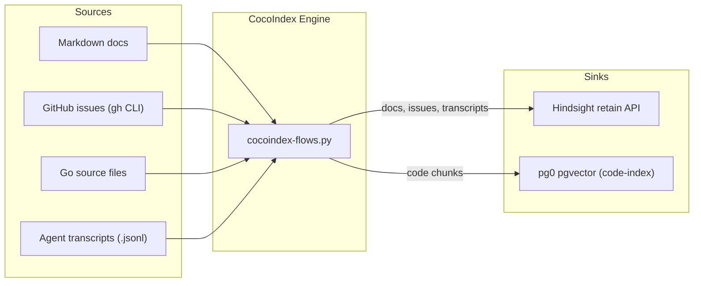

# CocoIndex Operations Guide

## Overview

CocoIndex is the incremental ingestion engine in the Engram stack. It replaces
batch scripts (`ingest-docs.py`, `ingest-issues.py`) with continuous, delta-aware
sync for four source types: documentation, GitHub issues, codebase, and agent
transcripts.

CocoIndex runs as a KeepAlive launchd service alongside Hindsight. It watches
source directories and APIs for changes, processes only the delta, and writes
results either through the Hindsight retain API (for docs, issues, transcripts)
or directly into pgvector tables (for the code index).



---

## Flow Catalog

CocoIndex declares four flows, each with a source, transform pipeline, and sink.

| Flow | Source | Transforms | Sink | Frequency |
|------|--------|-----------|------|-----------|
| **docs** | Markdown files in `ENGRAM_DOCS_DIR` + repo docs | Split by heading → chunk → embed | Hindsight retain API (`kubernaut-docs` bank) | File-watching (instant) |
| **issues** | GitHub issues + PRs via `gh` CLI | Serialize issue/PR + comments → chunk → embed | Hindsight retain API (`kubernaut-issues` bank) | Polling every 5 min (`ENGRAM_ISSUES_POLL_SECONDS`) |
| **code** | Go source files in `ENGRAM_CODE_DIR` | tree-sitter AST parse → dense embed + BM25 tsvector | pg0 pgvector hybrid search (`code-index`) | File-watching (instant) |
| **transcripts** | `.jsonl` files in Cursor transcripts dir | Extract correction windows → embed | Hindsight retain API (`cursor-memory` bank) | File-watching (instant) |

### Transform Details

**Docs flow:** Splits markdown by `##` headings into sections, chunks sections
exceeding the token limit, and generates embeddings using the same local ONNX
model as Hindsight.

**Issues flow:** Fetches all issues and PRs via `gh issue list --limit 10000`
and `gh pr list --limit 10000` (both with `--state all`). Each item is tagged
with `_kind` (`issue` or `pr`) and gets a distinct `document_id` (`issue-N` or
`pr-N`). Title + body + human comments are serialized, chunked, and pushed to
Hindsight with `kind` and `state` tags. Re-ingestion is idempotent.

**Code flow:** Uses tree-sitter to parse Go source files into an AST, then
extracts function declarations, type definitions, and method blocks as individual
chunks. Each chunk includes the file path, line range, and package name as
metadata. Each row stores both a dense embedding (`vector(384)` via
`all-MiniLM-L6-v2`) and a `search_text` column used for BM25 full-text search.
A `declare_sql_command_attachment` on the table creates a PostgreSQL trigger
that auto-populates a `tsvector` column and GIN index from `search_text` — this
is managed entirely by CocoIndex's lifecycle (setup on create, teardown on
removal). The result is **hybrid search**: `cocoindex-search.py` queries both
the dense vector index and the BM25 index, then fuses results via Reciprocal
Rank Fusion (RRF).

**Transcripts flow:** Scans `.jsonl` transcript files for correction windows
(same regex patterns as `nightly-learn.py`) and retains them through the
Hindsight API. This supplements — not replaces — the nightly learning pipeline,
which also runs LLM extraction and reflection.

---

## Hybrid Code Search

The code flow produces a table (`cocoindex.code_embeddings`) that supports
two retrieval methods simultaneously:

| Method | Column | Index | Best for |
|--------|--------|-------|----------|
| **Dense** (semantic) | `embedding vector(384)` | HNSW/IVFFlat | Conceptual queries: "how does rate limiting work?" |
| **BM25** (lexical) | `search_vector tsvector` | GIN | Exact identifiers: "ParseConfig", "RemediationRequest" |

### How it works

1. **At ingestion**, each code chunk gets a dense embedding (`all-MiniLM-L6-v2`)
   and a `search_text` column (filepath + code concatenated).
2. A **CocoIndex SQL command attachment** creates a PostgreSQL trigger that
   auto-populates a `tsvector` column from `search_text` on every INSERT/UPDATE,
   plus a GIN index for fast BM25 queries. CocoIndex manages the full lifecycle
   of this infrastructure (setup and teardown).
3. **At query time**, `cocoindex-search.py` runs both dense and BM25 retrieval
   in parallel, then fuses results using **Reciprocal Rank Fusion (RRF)** with
   `k=60`.

### Search modes

The MCP tool `cocoindex_search` accepts a `mode` parameter:

| Mode | Behavior |
|------|----------|
| `hybrid` (default) | Dense + BM25 → RRF fusion. Best overall quality. |
| `dense` | Semantic similarity only. Best for conceptual, natural-language queries. |
| `bm25` | Keyword matching only. Best for exact identifiers and function names. |

### CLI testing

```bash
# Hybrid (default)
python3 cocoindex-search.py --query "how does the reconciler handle errors"

# Dense only
python3 cocoindex-search.py --query "error handling in reconciler" --mode dense

# BM25 only — great for exact identifiers
python3 cocoindex-search.py --query "ParseConfig" --mode bm25
```

### Why SQL command attachment (not a manual trigger)

CocoIndex's `declare_sql_command_attachment()` lets us declare arbitrary SQL
that CocoIndex manages as part of the table's lifecycle. This means:

- **Setup**: trigger, function, GIN index, and tsvector column are created
  automatically when the flow initializes.
- **Teardown**: if the attachment is removed or changed, CocoIndex runs the
  teardown SQL to clean up.
- **No external migration scripts**: everything is declared in `cocoindex-flows.py`.

This is preferred over manually creating triggers via `psql` because it keeps
the full schema under CocoIndex's control.

---

## Running Modes

### Live mode (default)

```bash
python3 cocoindex-flows.py --mode live
```

Runs all four flows concurrently using threads:
- **docs, code, transcripts**: File-watching threads using CocoIndex live mode
  (fsevents on macOS). Changes are detected and processed within seconds.
- **issues**: Polling thread that fetches all issues + PRs from GitHub every
  `ENGRAM_ISSUES_POLL_SECONDS` (default: 300s / 5 min).

This is the mode used by the launchd plist. The `report_to_stdout` flag is
disabled in concurrent mode (CocoIndex only allows one progress reporter),
so all output goes to `cocoindex-stderr.log`.

### Backfill mode

```bash
python3 cocoindex-flows.py --mode backfill
```

Processes all existing sources from scratch, then exits. Use for:
- Initial setup (first install)
- Recovery after data loss
- After changing embedding models
- After adding a new source directory

Backfill is idempotent — running it multiple times produces the same result.

---

## Monitoring

### Log files

| File | Content |
|------|---------|
| `~/.hindsight/logs/cocoindex-stderr.log` | All flow output: startup, poll cycles, errors, warnings |
| `~/.hindsight/logs/cocoindex-stdout.log` | Empty in live mode (progress reporting disabled for concurrency) |

### Checking flow health

```bash
# Is CocoIndex running?
launchctl list | grep cocoindex

# Recent activity (all output goes to stderr in live mode)
tail -30 ~/.hindsight/logs/cocoindex-stderr.log

# Check issues poll cycle
grep "Issues poll:" ~/.hindsight/logs/cocoindex-stderr.log | tail -5

# Code index table size
psql -h localhost -p 5432 -U hindsight -d hindsight -c "SELECT count(*) FROM code_embeddings;"

# Full coverage and freshness report
python3 report.py
```

### Healthy indicators

- `Issues poll: complete` messages appear every ~5 minutes in stderr log
- All four apps show `Starting` messages at startup (docs, code, transcripts, issues)
- No repeated errors in stderr log
- `launchctl list` shows PID (not `-`) for the cocoindex service
- `report.py` shows all sources as "Healthy" in the DATA FRESHNESS section

---

## Troubleshooting

### pg0 not running

```
Error: connection refused on port 5433
```

CocoIndex writes to the same pg0 instance as Hindsight. If pg0 is down, both
Hindsight recall and CocoIndex ingestion fail.

```bash
# Check Hindsight service (which manages pg0)
launchctl list | grep hindsight
curl -s http://localhost:8888/health

# Restart if needed
launchctl kickstart -k gui/$(id -u)/io.vectorize.hindsight.service
```

### Embedding model mismatch

If you upgrade the embedding model in Hindsight, the CocoIndex code-index
embeddings (stored separately in pgvector) will use a different vector space.

**Fix:** Run a full backfill to re-embed all code chunks:

```bash
python3 cocoindex-flows.py --mode backfill
```

### `gh` CLI not authenticated

The issues flow requires an authenticated GitHub CLI session.

```bash
gh auth status
# If expired:
gh auth login
```

### CocoIndex not starting via launchd

```bash
# Check for plist errors
launchctl list | grep cocoindex

# View launch errors
tail -50 ~/.hindsight/logs/cocoindex-stderr.log

# Reload
launchctl unload ~/Library/LaunchAgents/io.vectorize.cocoindex.service.plist
launchctl load ~/Library/LaunchAgents/io.vectorize.cocoindex.service.plist
```

### Issues/PRs not fully indexed

If `report.py` shows fewer indexed items than total issues + PRs:

```bash
# Check how many the flow is fetching
grep "Fetched.*from" ~/.hindsight/logs/cocoindex-stderr.log | tail -5
```

The flow uses `--limit 10000` for both `gh issue list` and `gh pr list`. If you
have more than 10,000 items, increase the limit in `cocoindex-flows.py`.

### Stale code index results

If code search returns outdated results, the delta processor may have missed
file changes (e.g., files modified outside the watched directory).

```bash
# Force reprocessing
python3 cocoindex-flows.py --mode backfill
```

---

## Adding New Sources

To declare a new CocoIndex flow:

1. Define a source connector in `cocoindex-flows.py` (file watcher, API poller,
   or database reader)
2. Add transform steps (chunking, embedding, metadata extraction)
3. Configure the sink (Hindsight retain API for memory banks, or pgvector for
   direct search)
4. Test with backfill mode: `python3 cocoindex-flows.py --mode backfill`
5. Verify the data appears in recall or search results

CocoIndex handles lineage tracking automatically — when a source document is
modified, only its chunks are re-processed. When a source is deleted, its
chunks are removed from the sink.

---

## Cost Model

| Component | Cost | Notes |
|-----------|------|-------|
| Embeddings | $0 | Local ONNX model (same as Hindsight) |
| tree-sitter parsing | $0 | CPU-only, no external API |
| GitHub API | $0 | Uses `gh` CLI with authenticated rate limit |
| Delta processing | $0 | CPU-only incremental reprocessing |
| Storage | ~50 MB | pgvector table for code-index (scales with codebase size) |

**Total: $0/month** — CocoIndex runs entirely locally with no LLM or external
API costs. The only resource consumed is CPU time for embedding generation and
AST parsing, which is negligible on Apple Silicon.

---

## See Also

- **[Project Overview](../README.md)** — what Engram is, quick start, cost summary
- **[Installation Guide](INSTALL.md)** — full setup including CocoIndex installation
- **[Architecture & Internals](README.md)** — design decisions, knowledge graph, flow diagrams
- **[Metrics and Monitoring](METRICS.md)** — CocoIndex-aware metrics, freshness tracking
