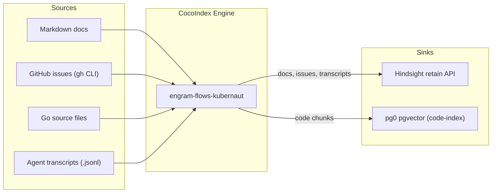

# CocoIndex Operations Guide

## Overview

CocoIndex is the incremental ingestion engine in the Engram stack. It replaces
batch scripts (`ingest-docs.py`, `ingest-issues.py`) with continuous, delta-aware
sync for four source types: documentation, GitHub issues, codebase, and agent
transcripts.

CocoIndex runs as a KeepAlive launchd service alongside Hindsight. It watches
source directories and APIs for changes, processes only the delta, and writes
results either through the Hindsight retain API (for docs, issues, transcripts)
or directly into pgvector tables (for the code index).


```mermaid
flowchart LR
    subgraph sources["Sources"]
        docs["Markdown docs"]
        issues["GitHub issues (gh CLI)"]
        code["Go source files"]
        transcripts["Agent transcripts (.jsonl)"]
    end

    subgraph cocoindex["CocoIndex Engine"]
        flows["engram-flows-kubernaut"]
    end

    subgraph sinks["Sinks"]
        hindsight["Hindsight retain API"]
        pgvector["pg0 pgvector (code-index)"]
    end

    docs --> flows
    issues --> flows
    code --> flows
    transcripts --> flows
    flows -->|"docs, issues, transcripts"| hindsight
    flows -->|"code chunks"| pgvector
```

---

## Flow Catalog

CocoIndex declares four flows, each with a source, transform pipeline, and sink.

| Flow | Source | Transforms | Sink | Frequency |
|------|--------|-----------|------|-----------|
| **docs** | Markdown files in `ENGRAM_DOCS_DIR` + repo docs | Split by heading → chunk → embed | Hindsight retain API (`kubernaut-docs` bank) | File-watching (instant) |
| **issues** | GitHub issues + PRs via `gh` CLI | Serialize issue/PR + comments → chunk → embed | Hindsight retain API (`kubernaut-issues` bank) | Polling every 5 min (`ENGRAM_ISSUES_POLL_SECONDS`) |
| **code** | Go source files in `ENGRAM_CODE_DIR` | tree-sitter AST parse → dense embed + BM25 tsvector | pg0 pgvector hybrid search (`code-index`) | File-watching (instant) |
| **transcripts** | `.jsonl` files in Cursor transcripts dir | Extract correction windows → embed | Hindsight retain API (`cursor-memory` bank) | File-watching (instant) |

### Transform Details

**Docs flow:** Splits markdown by `##` headings into sections, chunks sections
exceeding the token limit, and generates embeddings using the same local ONNX
model as Hindsight.

**Issues flow:** Fetches all issues and PRs via `gh issue list --limit 10000`
and `gh pr list --limit 10000` (both with `--state all`). Each item is tagged
with `_kind` (`issue` or `pr`) and gets a distinct `document_id` (`issue-N` or
`pr-N`). Title + body + human comments are serialized, chunked, and pushed to
Hindsight with `kind` and `state` tags. Re-ingestion is idempotent.

**Code flow:** Detects each file's language from its extension
(`cocoindex.ops.text.detect_code_language`) and splits it with cocoindex's
own tree-sitter-backed `RecursiveSplitter`, which descends the language's AST
(function/type/block nodes) so chunk boundaries land on those nodes instead of
an arbitrary character offset, and only falls back to a raw character cut for
a single node that still exceeds `chunk_size` on its own. A file's chunks are
embedded together via cocoindex's own `SentenceTransformerEmbedder`
(`chunking.embed_code_chunks()`), whose `@coco.fn.as_async(batching=True)`
wrapper coalesces the concurrent `embed()` calls into one batched
`model.encode()` call per file instead of one call per chunk, and the
pgvector column's dimension is read from the model itself
(`chunking.code_embedding_dim()`) rather than hardcoded. Each row stores the
file path, a positional `chunk_index`, the chunk text, the dense embedding,
and a `search_text` column used for BM25 full-text search — there is no
separate line-range or package-name metadata column.
A `declare_sql_command_attachment` on the table creates a PostgreSQL trigger
that auto-populates a `tsvector` column and GIN index from `search_text` — this
is managed entirely by CocoIndex's lifecycle (setup on create, teardown on
removal). The result is **hybrid search**: `cocoindex-search.py` queries both
the dense vector index and the BM25 index, then fuses results via Reciprocal
Rank Fusion (RRF).

**Transcripts flow:** Scans `.jsonl` transcript files for correction windows
(same regex patterns as `nightly-learn.py`) and retains them through the
Hindsight API. This supplements — not replaces — the nightly learning pipeline,
which also runs LLM extraction and reflection.

---

## Hybrid Code Search

The code flow produces a table (`cocoindex.code_embeddings`) that supports
two retrieval methods simultaneously:

| Method | Column | Index | Best for |
|--------|--------|-------|----------|
| **Dense** (semantic) | `embedding vector(N)` (N from the active model, e.g. 384 for `all-MiniLM-L6-v2`) | HNSW/IVFFlat | Conceptual queries: "how does rate limiting work?" |
| **BM25** (lexical) | `search_vector tsvector` | GIN | Exact identifiers: "ParseConfig", "RemediationRequest" |

### How it works

1. **At ingestion**, each code chunk gets a dense embedding (`all-MiniLM-L6-v2`)
   and a `search_text` column (filepath + code concatenated).
2. A **CocoIndex SQL command attachment** creates a PostgreSQL trigger that
   auto-populates a `tsvector` column from `search_text` on every INSERT/UPDATE,
   plus a GIN index for fast BM25 queries. CocoIndex manages the full lifecycle
   of this infrastructure (setup and teardown).
3. **At query time**, `cocoindex-search.py` runs both dense and BM25 retrieval
   in parallel, then fuses results using **Reciprocal Rank Fusion (RRF)** with
   `k=60`.

### Search modes

The MCP tool `cocoindex_search` accepts a `mode` parameter:

| Mode | Behavior |
|------|----------|
| `hybrid` (default) | Dense + BM25 → RRF fusion. Best overall quality. |
| `dense` | Semantic similarity only. Best for conceptual, natural-language queries. |
| `bm25` | Keyword matching only. Best for exact identifiers and function names. |

### CLI testing

```bash
# Hybrid (default)
~/.hindsight/venv/bin/engram-search-kubernaut --query "how does the reconciler handle errors"

# Dense only
~/.hindsight/venv/bin/engram-search-kubernaut --query "error handling in reconciler" --mode dense

# BM25 only — great for exact identifiers
~/.hindsight/venv/bin/engram-search-kubernaut --query "ParseConfig" --mode bm25
```

## Structural Pattern Search

Hybrid search above answers "find code *about* X" (semantic/lexical). Every
`*-cocoindex-search.py` script also exposes a second MCP tool for the
opposite question — "find code *shaped like* X" — via CocoIndex's
`CodePattern` (tree-sitter-backed by-example structural matching).

| Project | Tool | Languages |
|---------|------|-----------|
| kubernaut | `cocoindex_pattern_search` | go (kubernaut, kubernaut-operator), typescript/tsx (kubernaut-console) |
| koku | `koku_code_pattern_search` | python |
| engram | `engram_code_pattern_search` | python |
| dcm | `dcm_code_pattern_search` | go (8 repos — see `repo` param) |

### How it works

Unlike hybrid search, there is no structural-pattern *index* — `CodePattern`
parses source directly, so each call walks the project's live checkout
(`engram.chunking.find_code_files()`, scoped to the exact same
`included_patterns`/`excluded_patterns` each project's `engram.flows.<project>`
module already uses for ingestion, so pattern search never drifts from what's
indexed).
For each candidate file: a cheap parse-free prefilter rejects files that
can't possibly match, then a match renders with enclosing-scope context via
`render_match()`. See docs/FINDINGS.md 2026-08-07 for the spike that
validated this.

### Pattern syntax

Write an example of the shape you want. `\NAME` is a metavariable matching
one AST node; `\(NAME*\)` matches zero or more (e.g. a parameter list).
Omitting a body/block entirely means "don't care what's inside":

```bash
# Any Go function returning exactly (bool, error), regardless of name,
# params, or body:
~/.hindsight/venv/bin/engram-search-kubernaut --pattern 'func \NAME(\(A*\)) (bool, error)' --language go

# Any Python function/method, regardless of body:
~/.hindsight/venv/bin/engram-search-koku --pattern 'def \NAME(\(A*\)):' --language python

# Scope to one of DCM's 8 repos:
~/.hindsight/venv/bin/engram-search-dcm --pattern 'func \NAME(\(A*\)) error' --language go --repo dcm-cli
```

### What this is NOT: complementary to Serena, not a replacement

`CodePattern` is purely syntactic. It has no type resolution (won't match
`(ok bool, err error)` against a search for `(bool, error)`), can't find
references/callers, has no call graph, and produces no diagnostics. Serena
(LSP-wrapping — `gopls`/`pyright`/`rust-analyzer`/`typescript-language-server`
depending on project language, see `docs/NEW_PROJECT_SETUP.md#7-choose-your-code-intelligence-backend`)
is the default code-intelligence backend across every onboarded project and
already covers exactly those type-aware, cross-file needs — adding
`CodePattern` does not replace it. Its distinct value is answering "find
every X shaped like this" queries Serena can't do (LSP navigation starts from
a known symbol/cursor position, not a structural shape), while reusing
CocoIndex — infrastructure Engram already runs — instead of standing up a
separate MCP server per language. See
`docs/README.md#hindsight-vs-cocoindex-vs-serena-division-of-labor` for the
full three-way comparison across all of Hindsight, CocoIndex, and Serena.

### Why SQL command attachment (not a manual trigger)

CocoIndex's `declare_sql_command_attachment()` lets us declare arbitrary SQL
that CocoIndex manages as part of the table's lifecycle. This means:

- **Setup**: trigger, function, GIN index, and tsvector column are created
  automatically when the flow initializes.
- **Teardown**: if the attachment is removed or changed, CocoIndex runs the
  teardown SQL to clean up.
- **No external migration scripts**: everything is declared in `engram.flows.kubernaut`.

This is preferred over manually creating triggers via `psql` because it keeps
the full schema under CocoIndex's control.

---

## Call-Graph Queries (spike)

**Status: spike, engram-only, live-rebuild-per-query, no persistence yet.**
See `docs/CALL_GRAPH_CLUSTERING.md` for the full feasibility study, measured
numbers, and Serena cross-check results; this is a short pointer, not a
duplicate.

Structural pattern search above answers "find code shaped like X" within one
file at a time. `engram-search-engram` additionally exposes 3 MCP tools (plus
matching CLI flags) that build a cross-file call graph from the same
`CodePattern` infrastructure and answer relational questions about it:

```bash
# Who (transitively) calls this function -- "what breaks if I change this":
~/.hindsight/venv/bin/engram-search-engram --blast-radius 'pattern_search_code' --depth 2

# Does A ever reach B through a chain of calls, and how:
~/.hindsight/venv/bin/engram-search-engram --shortest-path 'main' 'find_code_files'

# Which Leiden-detected cluster of related functions does X belong to:
~/.hindsight/venv/bin/engram-search-engram --cluster 'find_code_files'
```

Every call rebuilds the graph fresh (no persisted index) and logs elapsed
time + node/edge/unresolved/ambiguous-call counts at `log.info`. Same
accuracy ceiling as structural pattern search, plus one more: call
resolution is name-based with no type info, so a function name duplicated
across files (this repo has several — `pattern_search_code` is defined once
per `*_code_pattern_search` module) is a genuine risk of false-positive
edges. Measured via a Serena cross-check: 100% recall, ~58% precision in a
5-function sample, precision loss concentrated entirely in that
duplicated-name case — then fixed with signature-compatibility filtering
(candidates whose parameter list can't accept a call's keyword arguments are
dropped) plus Graphify-style ambiguous-edge reporting (an edge is only added
when exactly one candidate survives filtering; 2+ surviving candidates are
recorded in `graph.graph["ambiguous_calls"]` and surfaced via
`blast_radius`'s output instead of guessed at). Re-measured after the fix:
the `pattern_search_code` false positives went to zero. See
`docs/CALL_GRAPH_CLUSTERING.md` for the full before/after numbers.

---

## Running Modes

### Live mode (default)

```bash
~/.hindsight/venv/bin/engram-flows-kubernaut --mode live
```

Runs all four flows concurrently using threads:
- **docs, code, transcripts**: File-watching threads using CocoIndex live mode
  (fsevents on macOS). Changes are detected and processed within seconds.
- **issues**: Polling thread that fetches all issues + PRs from GitHub every
  `ENGRAM_ISSUES_POLL_SECONDS` (default: 300s / 5 min).

This is the mode used by the launchd plist (currently via the
`~/.hindsight/cocoindex-flows.py` symlink rather than this console script
directly — see [INSTALL.md](INSTALL.md) step 16). The `report_to_stdout` flag
is disabled in concurrent mode (CocoIndex only allows one progress reporter),
so all output goes to `cocoindex-stderr.log`.

### Backfill mode

```bash
~/.hindsight/venv/bin/engram-flows-kubernaut --mode backfill
```

Processes all existing sources from scratch, then exits. Use for:
- Initial setup (first install)
- Recovery after data loss
- After changing embedding models
- After adding a new source directory

Backfill is idempotent — running it multiple times produces the same result.

---

## Monitoring

### Log files

| File | Content |
|------|---------|
| `~/.hindsight/logs/cocoindex-stderr.log` | All flow output: startup, poll cycles, errors, warnings |
| `~/.hindsight/logs/cocoindex-stdout.log` | Empty in live mode (progress reporting disabled for concurrency) |

### Checking flow health

```bash
# Is CocoIndex running?
launchctl list | grep cocoindex

# Recent activity (all output goes to stderr in live mode)
tail -30 ~/.hindsight/logs/cocoindex-stderr.log

# Check issues poll cycle
grep "Issues poll:" ~/.hindsight/logs/cocoindex-stderr.log | tail -5

# Code index table size
psql -h localhost -p 5432 -U hindsight -d hindsight -c "SELECT count(*) FROM code_embeddings;"

# Full coverage and freshness report
python3 -m engram.maintenance.report
```

### Healthy indicators

- `Issues poll: complete` messages appear every ~5 minutes in stderr log
- All four apps show `Starting` messages at startup (docs, code, transcripts, issues)
- No repeated errors in stderr log
- `launchctl list` shows PID (not `-`) for the cocoindex service
- `report.py` shows all sources as "Healthy" in the DATA FRESHNESS section

---

## Troubleshooting

### pg0 not running

```
Error: connection refused on port 5433
```

CocoIndex writes to the same pg0 instance as Hindsight. If pg0 is down, both
Hindsight recall and CocoIndex ingestion fail.

```bash
# Check Hindsight service (which manages pg0)
launchctl list | grep hindsight
curl -s http://localhost:8888/health

# Restart if needed (force a health-checked blue/green swap, not a raw kill --
# see docs/FINDINGS.md 2026-08-02 for why this matters)
~/.hindsight/hindsight-blue-green-restart.sh
```

### Embedding model mismatch

If you upgrade the embedding model in Hindsight, the CocoIndex code-index
embeddings (stored separately in pgvector) will use a different vector space.

**Fix:** Run a full backfill to re-embed all code chunks:

```bash
~/.hindsight/venv/bin/engram-flows-kubernaut --mode backfill
```

### `gh` CLI not authenticated

The issues flow requires an authenticated GitHub CLI session.

```bash
gh auth status
# If expired:
gh auth login
```

### CocoIndex not starting via launchd

```bash
# Check for plist errors
launchctl list | grep cocoindex

# View launch errors
tail -50 ~/.hindsight/logs/cocoindex-stderr.log

# Reload
launchctl unload ~/Library/LaunchAgents/io.vectorize.cocoindex.service.plist
launchctl load ~/Library/LaunchAgents/io.vectorize.cocoindex.service.plist
```

### Issues/PRs not fully indexed

If `python3 -m engram.maintenance.report` shows fewer indexed items than
total issues + PRs:

```bash
# Check how many the flow is fetching
grep "Fetched.*from" ~/.hindsight/logs/cocoindex-stderr.log | tail -5
```

The flow uses `--limit 10000` for both `gh issue list` and `gh pr list`. If you
have more than 10,000 items, increase the limit in `engram.flows.kubernaut`.

### Stale code index results

If code search returns outdated results, the delta processor may have missed
file changes (e.g., files modified outside the watched directory).

```bash
# Force reprocessing
~/.hindsight/venv/bin/engram-flows-kubernaut --mode backfill
```

---

## Adding New Sources

To declare a new CocoIndex flow:

1. Define a source connector in `engram.flows.kubernaut` (file watcher, API
   poller, or database reader)
2. Add transform steps (chunking, embedding, metadata extraction)
3. Configure the sink (Hindsight retain API for memory banks, or pgvector for
   direct search)
4. Test with backfill mode: `~/.hindsight/venv/bin/engram-flows-kubernaut --mode backfill`
5. Verify the data appears in recall or search results

CocoIndex handles lineage tracking automatically — when a source document is
modified, only its chunks are re-processed. When a source is deleted, its
chunks are removed from the sink.

---

## Cost Model

| Component | Cost | Notes |
|-----------|------|-------|
| Embeddings | $0 | Local ONNX model (same as Hindsight) |
| tree-sitter parsing | $0 | CPU-only, no external API |
| GitHub API | $0 | Uses `gh` CLI with authenticated rate limit |
| Delta processing | $0 | CPU-only incremental reprocessing |
| Storage | ~50 MB | pgvector table for code-index (scales with codebase size) |

**Total: $0/month** — CocoIndex runs entirely locally with no LLM or external
API costs. The only resource consumed is CPU time for embedding generation and
AST parsing, which is negligible on Apple Silicon.

---

## See Also

- **[Project Overview](../README.md)** — what Engram is, quick start, cost summary
- **[Installation Guide](INSTALL.md)** — full setup including CocoIndex installation
- **[Architecture & Internals](README.md)** — design decisions, knowledge graph, flow diagrams
- **[Metrics and Monitoring](METRICS.md)** — CocoIndex-aware metrics, freshness tracking
