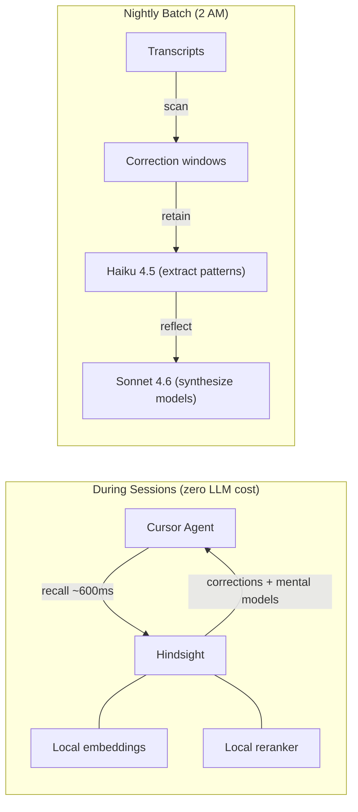
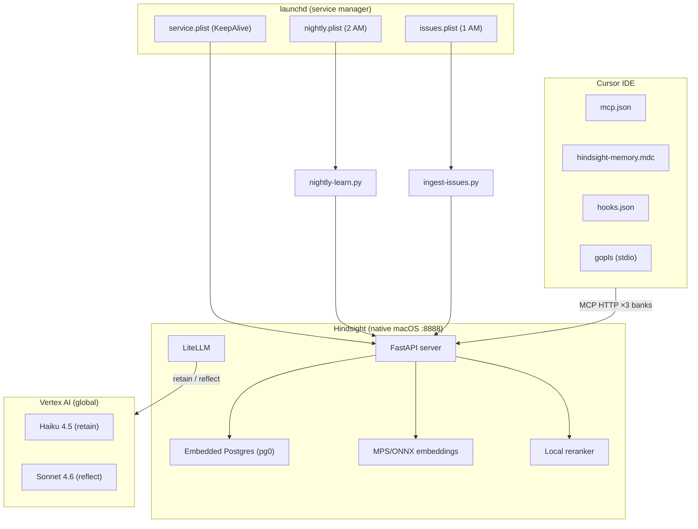
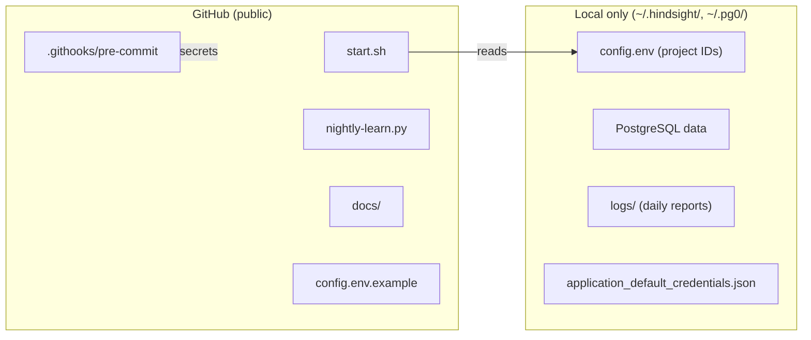
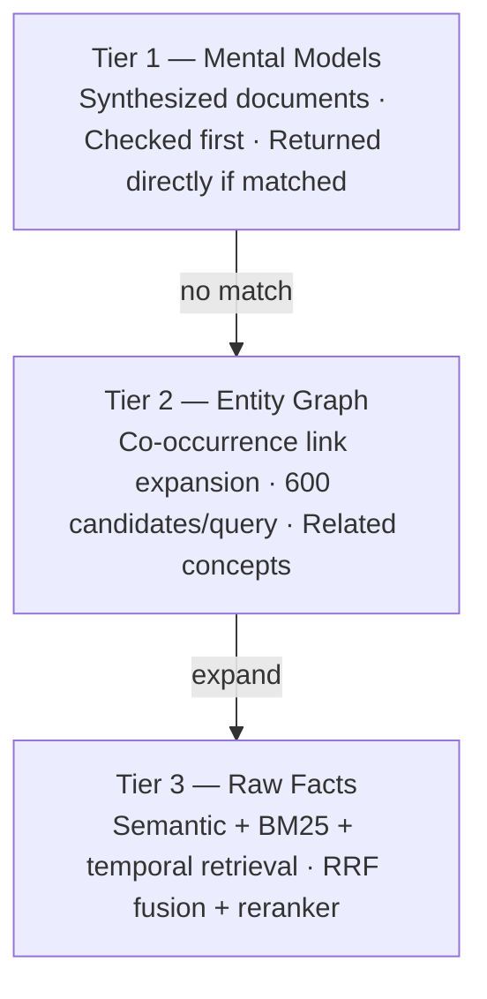

# Architecture & Internals

Detailed design documentation for Engram. For an overview of what this project
does and why, see the [root README](../README.md).

## Contents

- [How It Works](#how-it-works)
- [Key Design Decisions](#key-design-decisions)
- [Architecture](#architecture)
- [Knowledge Graph and Mental Models](#knowledge-graph-and-mental-models)
- [How Correction Detection Works](#how-correction-detection-works)
- [Backup and Restore](#backup-and-restore)

See also: [Installation Guide](INSTALL.md) | [Metrics and Monitoring](METRICS.md)

---

## How It Works



### Key Design Decisions

| Decision | Rationale |
|----------|-----------|
| **Recall-only during sessions** | Zero token cost, pure local vector search (~600ms) |
| **Retain in nightly batch** | Avoids hitting token quotas during work hours |
| **Haiku 4.5 for extraction** | 10x cheaper than Sonnet for structured pattern extraction |
| **Sonnet 4.6 for reflection** | Complex reasoning about what patterns are effective |
| **Correction and instruction-focused** | Learns from corrections and explicit instructions |
| **Global endpoint** | Single Vertex AI endpoint, no region-specific routing |
| **Local embeddings + reranker** | No network calls for recall; runs on-device |

---

## Architecture



### Components

| Component | Location | Purpose |
|-----------|----------|---------|
| Project source | `<your-clone>/engram/` | Code pushed to GitHub |
| LLM config | `~/.hindsight/config.env` | Real project IDs, model names (never committed) |
| Hindsight process | `~/.hindsight/venv/bin/hindsight-api` | Native macOS service (launchd managed) |
| MCP config | `~/.cursor/mcp.json` | Connects Cursor to Hindsight (memory + docs + issues) + gopls |
| Cursor rule | `~/.cursor/rules/hindsight-memory.mdc` | Instructs agent to recall from all three banks |
| Nightly script | `nightly-learn.py` (symlinked to `~/.hindsight/`) | Processes transcripts, extracts patterns |
| Doc ingestion | `ingest-docs.py` | One-time doc ingestion into knowledge bank |
| Issue ingestion | `ingest-issues.py` | GitHub issues ingestion (nightly) |
| Mental models | `create-mental-models.py` | Create/refresh mental models across all banks |
| Effectiveness report | `report.py` | Metrics aggregation, token analysis, mental model stats |
| MCP hook | `cursor/hooks.json` + `hooks/log-mcp-calls.sh` | Real-time MCP call logging with hit/miss |
| Service plist | `~/Library/LaunchAgents/io.vectorize.hindsight.service.plist` | KeepAlive + RunAtLoad |
| Nightly plist | `~/Library/LaunchAgents/io.vectorize.hindsight.nightly.plist` | Midnight execution |
| Persistent storage | `~/.pg0/instances/hindsight/data/` | PostgreSQL data (survives reboots) |
| Logs | `~/.hindsight/logs/` | Daily JSON reports + recall-signals.jsonl |

### Memory Banks

| Bank | Content | Extraction Mode | LLM Cost |
|------|---------|-----------------|----------|
| `cursor-memory` | Corrections, instructions, workflow patterns | `concise` | Haiku 4.5 per window |
| `kubernaut-docs` | Published architecture, API, operations docs | `chunks` | $0 (embeddings only) |
| `kubernaut-issues` | GitHub issues: requirements, decisions, known bugs | `chunks` | $0 (embeddings only) |

### Security Boundary



---

## Knowledge Graph and Mental Models

### 3-Tier Recall Hierarchy

Hindsight uses a three-tier system for serving context during recall:



### Entity Graph

Hindsight automatically builds a knowledge graph through entity extraction on every `retain` call. Entities (services, concepts, patterns) are tracked with co-occurrence edges. During recall, the `link_expansion` retriever traverses these edges to find related facts that wouldn't match the query directly.

### Mental Models

Mental models are persistent, LLM-synthesized documents that sit above raw facts. They solve the problem of scattered individual memories — instead of returning 15 separate facts about "KA rate limiting" that the agent must synthesize mid-response, a mental model provides a pre-built document like:

> "KA Architecture: rate limiting uses per-IP sliding window with Redis, denials emit audit events, correlation_id is generated at ingress..."

#### Configured Models

| Bank | Model ID | Purpose | Refresh |
|------|----------|---------|---------|
| `cursor-memory` | `coding-conventions` | Naming, style, structure preferences | After consolidation |
| `cursor-memory` | `testing-methodology` | Test frameworks, patterns, coverage expectations | After consolidation |
| `cursor-memory` | `workflow-preferences` | Dev workflow, review process, tooling choices | After consolidation |
| `cursor-memory` | `architecture-decisions` | Design patterns, tech choices | Manual |
| `kubernaut-docs` | `ka-architecture` | KA service components, data flow, integration | Manual |
| `kubernaut-docs` | `af-pipeline` | AF pipeline stages, events, decisions | Manual |
| `kubernaut-docs` | `platform-topology` | Service interactions, infrastructure | Manual |
| `kubernaut-issues` | `active-priorities` | Open issues, priorities, platform direction | Nightly |
| `kubernaut-issues` | `known-bugs` | Known bugs, root causes, workarounds | Nightly |

#### Cross-Bank Association

True cross-bank entity linking is not natively supported (entities are per-bank). Mental models provide an effective workaround:

- The **same entity names** (e.g., "KA", "rate limiter") appear across all three banks
- When the agent recalls a topic, it hits mental models in multiple banks simultaneously
- The Cursor rule instructs recall from all three banks in parallel

The entity graph within each bank handles intra-bank association. Mental models lift this into cross-bank coherence by synthesizing the same topic from different angles (behavior vs. docs vs. issues).

#### Cost

- **Creation**: ~$0.50 one-time (9 models × Sonnet 4.6 reflect call)
- **Delta refresh**: ~$0.02 per refresh (only new facts since last refresh)
- **Recall benefit**: one coherent block replaces many scattered facts → fewer total tokens in agent context

---

## How Correction Detection Works

The nightly script scans Cursor agent transcripts (`.jsonl` files) for user messages that indicate the assistant made a mistake. It uses targeted regex patterns:

```python
"no that's wrong/incorrect"      # explicit rejection
"don't do that"                  # behavioral correction
"I said/meant ..."               # clarification of prior intent
"wrong file/path/approach/..."   # specific error callout
"that broke"                     # caused a failure
"undo that/this"                 # revert request
"that's not what I..."           # expectation mismatch
"you shouldn't have..."          # retrospective correction
"do not use / we don't use"     # convention enforcement
```

For each correction, a **window** of surrounding context is extracted (2 messages before + correction + 2 messages after). Only these focused windows are sent to Hindsight — not the full transcript.

### Example

```
[Context] User: deploy the service to staging
[Context] Assistant: Built image for linux/arm64 and pushed to ghcr.io...
[CORRECTION] User: wrong architecture, we deploy amd64. And we use quay.io not ghcr.
[Context] Assistant: You're right, rebuilding for linux/amd64 and pushing to quay.io...
```

Hindsight extracts: *"Build architecture must be linux/amd64 for staging deployments. Container registry is quay.io, not ghcr.io."*

Next session, when the user asks to deploy, recall surfaces this pattern.

---

## Backup and Restore

All persistent data lives in `~/.pg0/instances/hindsight/data/` (PostgreSQL).

```bash
# Backup
tar czf ~/engram-backup-$(date +%F).tar.gz ~/.pg0/instances/hindsight/data/

# Restore
launchctl unload ~/Library/LaunchAgents/io.vectorize.hindsight.service.plist
rm -rf ~/.pg0/instances/hindsight/data/
tar xzf ~/engram-backup-YYYY-MM-DD.tar.gz -C /
launchctl load ~/Library/LaunchAgents/io.vectorize.hindsight.service.plist
```

---

## See Also

- **[Project Overview](../README.md)** — what Engram is, quick start, cost summary
- **[Installation Guide](INSTALL.md)** — full setup from prerequisites to verification
- **[Customizing the Rule](INSTALL.md#customizing-the-rule)** — adapt the Cursor rule for your project (Python, Rust, etc.)
- **[Metrics and Monitoring](METRICS.md)** — observability, effectiveness tracking, report interpretation
