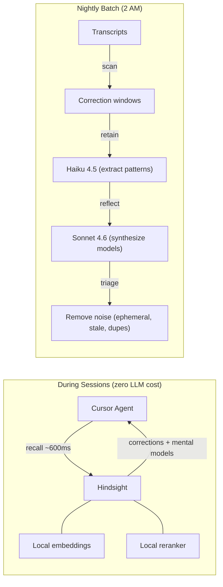
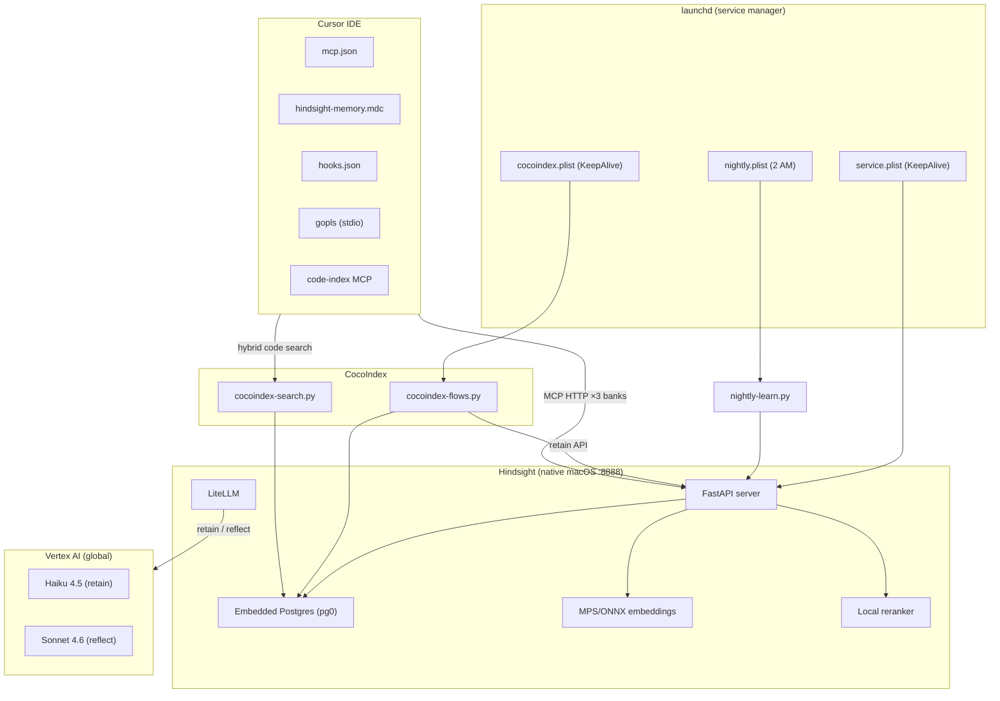
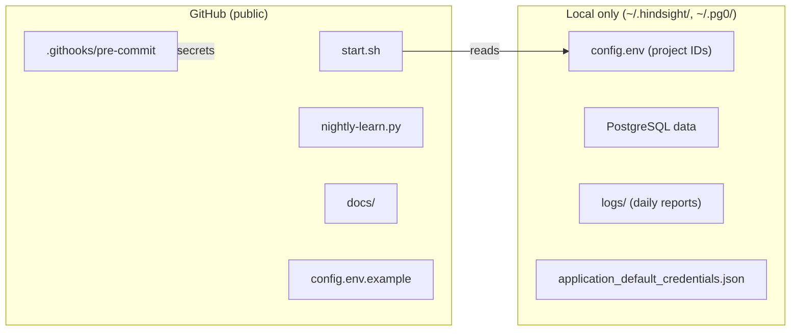
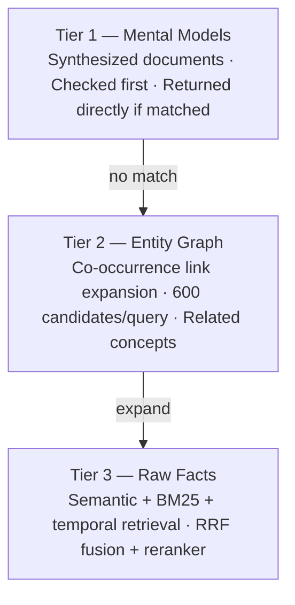

# Architecture & Internals

Detailed design documentation for Engram. For an overview of what this project
does and why, see the [root README](../README.md).

## Contents

- [How It Works](#how-it-works)
- [Key Design Decisions](#key-design-decisions)
- [Architecture](#architecture)
- [Hindsight vs. CocoIndex: Division of Labor](#hindsight-vs-cocoindex-division-of-labor)
- [Knowledge Graph and Mental Models](#knowledge-graph-and-mental-models)
- [How Correction Detection Works](#how-correction-detection-works)
- [Backup and Restore](#backup-and-restore)

See also: [Installation Guide](INSTALL.md) | [Metrics and Monitoring](METRICS.md) | [Dashboard](DASHBOARD.md)

---

## How It Works


```mermaid
flowchart LR
    subgraph session["During Sessions (zero LLM cost)"]
        A[Cursor Agent] -->|recall ~600ms| B[Hindsight]
        B -->|"corrections + mental models"| A
        B --- emb[Local embeddings]
        B --- rnk[Local reranker]
    end

    subgraph nightly["Nightly Batch (2 AM)"]
        C[Transcripts] -->|scan| D[Correction windows]
        D -->|retain| E["Haiku 4.5 (extract patterns)"]
        E -->|reflect| F["Sonnet 4.6 (synthesize models)"]
        F -->|triage| G["Remove noise (ephemeral, stale, dupes)"]
    end
```

### Key Design Decisions

| Decision | Rationale |
|----------|-----------|
| **Recall-only during sessions** | Zero token cost, pure local vector search (~600ms) |
| **Retain in nightly batch** | Avoids hitting token quotas during work hours |
| **Haiku 4.5 for extraction** | 10x cheaper than Sonnet for structured pattern extraction |
| **Sonnet 4.6 for reflection** | Complex reasoning about what patterns are effective |
| **Correction and instruction-focused** | Learns from corrections and explicit instructions |
| **Global endpoint** | Single Vertex AI endpoint, no region-specific routing |
| **Local embeddings + reranker** | No network calls for recall; runs on-device |

### Data Freshness

With CocoIndex integration, `kubernaut-docs` and `kubernaut-issues` banks are
now continuously fresh — CocoIndex runs as a KeepAlive launchd service, detects
source changes via delta processing, and re-ingests only the modified content.
This replaces the previous batch ingestion model (nightly `ingest-issues.py`,
manual `ingest-docs.py`) with sub-hour staleness for docs/issues and sub-minute
freshness for code.

| Source | Previous Model | CocoIndex Model | Target Freshness |
|--------|---------------|-----------------|------------------|
| Docs | Manual `ingest-docs.py` | File-watching (instant) | < 1 hour |
| Issues + PRs | Nightly `ingest-issues.py` (500 cap) | Polling every 5 min (all items) | < 5 minutes |
| Code | Not indexed | File-watching (instant) + hybrid search | < 5 minutes |
| Transcripts | Nightly batch | File-watching (instant) | < 1 hour |

---

## Architecture


```mermaid
graph TB
    subgraph cursor["Cursor IDE"]
        mcp_cfg["mcp.json"]
        rule["hindsight-memory.mdc"]
        hooks["hooks.json"]
        gopls["gopls (stdio)"]
        code_mcp["code-index MCP"]
    end

    subgraph engram["Hindsight (native macOS :8888)"]
        api["FastAPI server"]
        pg["Embedded Postgres (pg0)"]
        emb["MPS/ONNX embeddings"]
        rerank["Local reranker"]
        litellm["LiteLLM"]
    end

    subgraph cocoindex_engine["CocoIndex"]
        coco_flows["cocoindex-flows.py"]
        coco_search["cocoindex-search.py"]
    end

    subgraph vertex["Vertex AI (global)"]
        haiku["Haiku 4.5 (retain)"]
        sonnet["Sonnet 4.6 (reflect)"]
    end

    subgraph launchd["launchd (service manager)"]
        svc["service.plist (KeepAlive)"]
        nightly_plist["nightly.plist (2 AM)"]
        coco_plist["cocoindex.plist (KeepAlive)"]
    end

    cursor -->|"MCP HTTP ×3 banks"| api
    cursor -->|"hybrid code search"| coco_search
    api --> pg
    api --> emb
    api --> rerank
    litellm -->|"retain / reflect"| vertex
    svc --> api
    nightly_plist --> nightly_script["nightly-learn.py"]
    coco_plist --> coco_flows
    nightly_script --> api
    coco_flows --> pg
    coco_flows -->|"retain API"| api
    coco_search --> pg
```

### Components

| Component | Location | Purpose |
|-----------|----------|---------|
| Project source | `<your-clone>/engram/` | Code pushed to GitHub |
| LLM config | `~/.hindsight/config.env` | Real project IDs, model names (never committed) |
| Hindsight process | `~/.hindsight/venv/bin/hindsight-api` | Native macOS service (launchd managed) |
| MCP config | `~/.cursor/mcp.json` | Connects Cursor to Hindsight (memory + docs + issues) + gopls |
| Cursor rule | `~/.cursor/rules/hindsight-memory.mdc` | Instructs agent to recall from all three banks |
| Example rules | `cursor/examples/*.mdc` | Ready-made rules for Go, Python, Rust, TypeScript, minimal |
| Nightly script | `nightly-learn.py` (symlinked to `~/.hindsight/`) | Processes transcripts, extracts patterns |
| Doc ingestion | `ingest-docs.py` | One-time doc ingestion (deprecated — use CocoIndex) |
| Issue ingestion | `ingest-issues.py` | Manual issues ingestion (deprecated — use CocoIndex) |
| Mental models | `create-mental-models.py` | Create/refresh mental models across all banks |
| Memory triage | `triage-memories.py` | Nightly cleanup of low-value memories (ephemeral, stale, duplicate) |
| Memory recovery | `recover-memories.py` | One-time full reprocessing of all transcripts to rebuild the bank |
| Effectiveness report | `report.py` | Metrics aggregation, token analysis, mental model stats |
| Dashboard generator | `generate-dashboard.py` | Auto-updates `docs/DASHBOARD.md` from daily reports |
| MCP hook | `cursor/hooks.json` + `hooks/log-mcp-calls.sh` | Real-time MCP call logging with hit/miss |
| CocoIndex flows | `cocoindex-flows.py` (symlinked to `~/.hindsight/`) | Incremental ingestion for docs, issues, code, transcripts |
| Code search | `cocoindex-search.py` | MCP hybrid code search (dense + BM25 via RRF fusion) |
| Service plist | `~/Library/LaunchAgents/io.vectorize.hindsight.service.plist` | KeepAlive + RunAtLoad |
| Nightly plist | `~/Library/LaunchAgents/io.vectorize.hindsight.nightly.plist` | Midnight execution |
| CocoIndex plist | `~/Library/LaunchAgents/io.vectorize.cocoindex.service.plist` | KeepAlive continuous sync |
| Persistent storage | `~/.pg0/instances/hindsight/data/` | PostgreSQL data (survives reboots) |
| Logs | `~/.hindsight/logs/` | Daily JSON reports + recall-signals.jsonl |

### Memory Banks

| Bank | Content | Extraction Mode | LLM Cost |
|------|---------|-----------------|----------|
| `cursor-memory` | Corrections, instructions, workflow patterns | `concise` | Haiku 4.5 per window |
| `kubernaut-docs` | Published architecture, API, operations docs | `chunks` | $0 (embeddings only) |
| `kubernaut-issues` | GitHub issues + PRs: requirements, decisions, known bugs, design reviews | `chunks` | $0 (embeddings only) |
| `code-index` | Codebase semantic chunks (Go functions, types, blocks) | `tree-sitter + dense embed + BM25 tsvector` | $0 (local embeddings) |

---

## Hindsight vs. CocoIndex: Division of Labor

Hindsight and CocoIndex sit at different layers of the same pipeline and their
capabilities barely overlap — they are complementary, not substitutable for
one another.

| Capability | Hindsight | CocoIndex |
|---|---|---|
| **Core job** | Memory: judge what's worth remembering, store it, reason about it, serve it back | Ingestion: detect what changed at the source, keep the index fresh |
| **LLM involved** | Yes — Haiku extracts durable facts from raw windows (`retain`), Sonnet synthesizes mental models (`reflect`) | No — pure local embeddings (`all-MiniLM-L6-v2`) + tree-sitter parsing, zero LLM cost |
| **Storage it owns** | `cursor-memory`, `kubernaut-docs`, `kubernaut-issues` banks (its own schema/API) | `code-index` pgvector table only (self-managed table in the same Postgres instance) |
| **Retrieval it serves** | `recall` — semantic vector search + local reranker over distilled facts | Hybrid dense + BM25 (RRF fusion) — good for exact identifiers *and* concepts |
| **Higher-order reasoning** | Mental models (synthesizes many facts into a coherent doc), contradiction detection/resolution, project tagging | None — it doesn't synthesize or judge, it just chunks and indexes |
| **Freshness mechanism** | None built-in — needs something to call `retain` (nightly batch or CocoIndex) | File-watching / 5-min polling — the reason docs/issues/code went from nightly-batch to sub-hour/sub-minute fresh |
| **Code-aware chunking** | None (would chunk by paragraph/token count) | Tree-sitter AST parsing — chunks by function/type/method boundary |

**Relationship, not overlap**: for three of CocoIndex's four flows (docs, issues,
transcripts), CocoIndex is purely the ingestion/freshness layer — it detects a
change, chunks and embeds it, then calls Hindsight's `retain` API, which owns
storage and serves it back out over its own MCP tools (`hindsight`,
`hindsight-docs`, `hindsight-issues`). For the fourth flow (code), CocoIndex is
fully independent end to end — it writes into its own `code-index` table and
serves queries itself via `cocoindex_search`/`engram_code_search`; Hindsight
has no visibility into that data at all.

**Could one replace the other?** No, not cleanly in either direction:

- **CocoIndex replacing Hindsight** would leave a searchable log of raw,
  un-distilled chunks — losing the things that make it a *memory* system
  rather than a search index: turning a messy multi-message correction
  exchange into a durable, generalized fact, synthesizing many facts into a
  coherent mental model, and detecting/resolving when a new correction
  contradicts something already stored. This isn't hypothetical: CocoIndex's
  own transcripts flow (regex-based, no LLM) is explicitly a *supplement*,
  not a replacement, for the nightly Hindsight-based learning pipeline — it
  can't do that extraction/reflection work itself.
- **Hindsight replacing CocoIndex** for code search would be a real downgrade.
  Hindsight's zero-cost `chunks` extraction mode could technically hold code,
  but it lacks tree-sitter-aware chunking (chunk boundaries could land
  mid-function) and, more importantly, BM25/lexical retrieval — dense-only
  search is weak at "find the exact function `ParseConfig`," which is exactly
  what hybrid RRF fusion was built for. Hindsight also has no file-watching of
  its own; something still has to notice a source changed and call `retain`.

The short version: CocoIndex is the freshness + structural-indexing layer in
front of three of Hindsight's banks, plus a fully independent hybrid search
engine for the one content type (code) that needs AST-aware chunking and
exact-identifier matching Hindsight was never built to do. Remove CocoIndex
and Hindsight still works, just back to stale nightly-batch ingestion and zero
code search. Remove Hindsight and CocoIndex still works for code search, but
`cursor-memory`/docs/issues lose all LLM-based judgment, becoming a dumb,
ever-growing chunk store with no forgetting, synthesis, or contradiction
handling.

### Security Boundary


```mermaid
flowchart LR
    subgraph public["GitHub (public)"]
        start["start.sh"]
        nightly["nightly-learn.py"]
        docs["docs/"]
        example["config.env.example"]
        hook[".githooks/pre-commit"]
    end

    subgraph local["Local only (~/.hindsight/, ~/.pg0/)"]
        config["config.env (project IDs)"]
        pgdata["PostgreSQL data"]
        logs["logs/ (daily reports)"]
        adc["application_default_credentials.json"]
    end

    hook -.->|"blocks secrets"| public
    start -->|"reads"| config
```

---

## Knowledge Graph and Mental Models

### 3-Tier Recall Hierarchy

Hindsight uses a three-tier system for serving context during recall:


```mermaid
flowchart TB
    T1["Tier 1 — Mental Models\nSynthesized documents · Checked first · Returned directly if matched"]
    T2["Tier 2 — Entity Graph\nCo-occurrence link expansion · 600 candidates/query · Related concepts"]
    T3["Tier 3 — Raw Facts\nSemantic + BM25 + temporal retrieval · RRF fusion + reranker"]

    T1 -->|"no match"| T2 -->|"expand"| T3
```

> **Note:** Code search (`code-index`) runs as a parallel MCP tool
> (`cocoindex-search.py`), not through Hindsight's recall pipeline. It queries
> a separate pgvector table maintained by CocoIndex using **hybrid search** —
> dense vector similarity for semantic queries and BM25 full-text matching for
> exact identifiers, fused via Reciprocal Rank Fusion (RRF). It is invoked
> directly by the Cursor agent alongside — not instead of — the 3-tier recall
> hierarchy.

### Entity Graph

Hindsight automatically builds a knowledge graph through entity extraction on every `retain` call. Entities (services, concepts, patterns) are tracked with co-occurrence edges. During recall, the `link_expansion` retriever traverses these edges to find related facts that wouldn't match the query directly.

### Mental Models

Mental models are persistent, LLM-synthesized documents that sit above raw facts. They solve the problem of scattered individual memories — instead of returning 15 separate facts about "KA rate limiting" that the agent must synthesize mid-response, a mental model provides a pre-built document like:

> "KA Architecture: rate limiting uses per-IP sliding window with Redis, denials emit audit events, correlation_id is generated at ingress..."

#### Configured Models

| Bank | Model ID | Purpose | Refresh |
|------|----------|---------|---------|
| `cursor-memory` | `coding-conventions` | Naming, style, structure preferences | After consolidation |
| `cursor-memory` | `testing-methodology` | Test frameworks, patterns, coverage expectations | After consolidation |
| `cursor-memory` | `workflow-preferences` | Dev workflow, review process, tooling choices | After consolidation |
| `cursor-memory` | `architecture-decisions` | Design patterns, tech choices | Manual |
| `kubernaut-docs` | `ka-architecture` | KA service components, data flow, integration | Manual |
| `kubernaut-docs` | `af-pipeline` | AF pipeline stages, events, decisions | Manual |
| `kubernaut-docs` | `platform-topology` | Service interactions, infrastructure | Manual |
| `kubernaut-issues` | `active-priorities` | Open issues, priorities, platform direction | Nightly |
| `kubernaut-issues` | `known-bugs` | Known bugs, root causes, workarounds | Nightly |

#### Cross-Bank Association

True cross-bank entity linking is not natively supported (entities are per-bank). Mental models provide an effective workaround:

- The **same entity names** (e.g., "KA", "rate limiter") appear across all three banks
- When the agent recalls a topic, it hits mental models in multiple banks simultaneously
- The Cursor rule instructs recall from all three banks in parallel

The entity graph within each bank handles intra-bank association. Mental models lift this into cross-bank coherence by synthesizing the same topic from different angles (behavior vs. docs vs. issues).

#### Cost

- **Creation**: ~$0.50 one-time (9 models × Sonnet 4.6 reflect call)
- **Delta refresh**: ~$0.02 per refresh (only new facts since last refresh)
- **Recall benefit**: one coherent block replaces many scattered facts → fewer total tokens in agent context

---

## How Correction Detection Works

The nightly script scans Cursor agent transcripts (`.jsonl` files) for user messages that indicate the assistant made a mistake. It uses targeted regex patterns:

```python
"no that's wrong/incorrect"      # explicit rejection
"don't do that"                  # behavioral correction
"I said/meant ..."               # clarification of prior intent
"wrong file/path/approach/..."   # specific error callout
"that broke"                     # caused a failure
"undo that/this"                 # revert request
"that's not what I..."           # expectation mismatch
"you shouldn't have..."          # retrospective correction
"do not use / we don't use"     # convention enforcement
```

For each correction, a **window** of surrounding context is extracted (2 messages before + correction + 2 messages after). Only these focused windows are sent to Hindsight — not the full transcript.

### Example

```
[Context] User: deploy the service to staging
[Context] Assistant: Built image for linux/arm64 and pushed to ghcr.io...
[CORRECTION] User: wrong architecture, we deploy amd64. And we use quay.io not ghcr.
[Context] Assistant: You're right, rebuilding for linux/amd64 and pushing to quay.io...
```

Hindsight extracts: *"Build architecture must be linux/amd64 for staging deployments. Container registry is quay.io, not ghcr.io."*

Next session, when the user asks to deploy, recall surfaces this pattern.

---

## Backup, Restore, and Recovery

### Database backup (full state)

All persistent data lives in `~/.pg0/instances/hindsight/data/` (PostgreSQL).

```bash
# Backup
tar czf ~/engram-backup-$(date +%F).tar.gz ~/.pg0/instances/hindsight/data/

# Restore
launchctl unload ~/Library/LaunchAgents/io.vectorize.hindsight.service.plist
rm -rf ~/.pg0/instances/hindsight/data/
tar xzf ~/engram-backup-YYYY-MM-DD.tar.gz -C /
launchctl load ~/Library/LaunchAgents/io.vectorize.hindsight.service.plist
```

### Transcript-based recovery (rebuild from source)

If the memory bank is corrupted or suffers data loss, it can be rebuilt from
agent transcripts — the authoritative source of truth:

```bash
# Dry-run: show how many learning windows would be recovered
python3 recover-memories.py

# Full recovery: reprocess all transcripts
python3 recover-memories.py --apply

# Limit to last 30 days
python3 recover-memories.py --apply --max-age 30
```

The recovery script:
1. Backs up existing `watermarks.json` and `retained-hashes.json`
2. Resets both to force full reprocessing
3. Scans all transcripts for corrections and instructions
4. Re-extracts learning windows via Haiku extraction
5. Restores watermarks so the nightly pipeline resumes normally

This is slower than a database restore (each window goes through LLM extraction)
but works even when no database backup exists. The cost is approximately the
same as a fresh install's first nightly run (~$0.02 per window via Haiku 4.5).

### Memory triage (nightly cleanup)

The nightly pipeline includes a triage phase that removes low-value memories
(ephemeral narration, stale snapshots, near-duplicates) to keep retrieval
relevant. See [Metrics — Memory Triage](METRICS.md#memory-triage) for details.

---

## See Also

- **[Project Overview](../README.md)** — what Engram is, quick start, cost summary
- **[Installation Guide](INSTALL.md)** — full setup from prerequisites to verification
- **[Customizing the Rule](INSTALL.md#customizing-the-rule)** — adapt the Cursor rule for your project (Python, Rust, etc.)
- **[CocoIndex Operations](COCOINDEX.md)** — flow catalog, running modes, monitoring, troubleshooting
- **[Metrics and Monitoring](METRICS.md)** — observability, effectiveness tracking, report interpretation
- **[Effectiveness Dashboard](DASHBOARD.md)** — daily metrics trend, auto-updated by nightly pipeline
- **[Research Findings](FINDINGS.md)** — empirical results, incidents, and lessons learned
